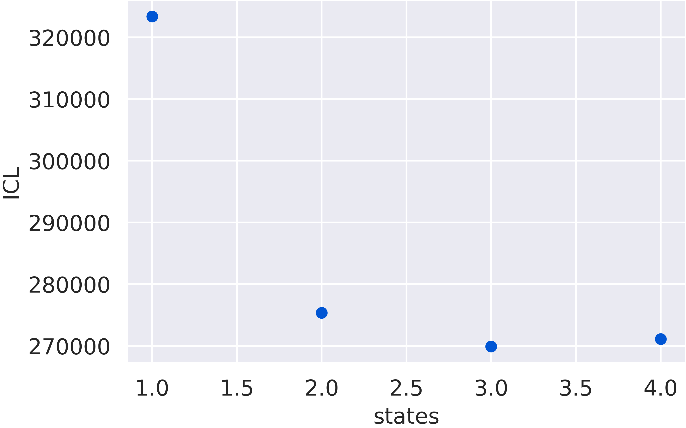

Access Divisors and Models
==========================

.. note::
    For this tutorial, we will assume the following code has been executed prior to all given code snippets (this come from the :ref:`tutorial <tuthidden>`)::

        # import statements
        import numpy as np
        from matplotlib import pyplot as plt
        import fretbursts as frb
        import burstH2MM as hmm
        sns = frb.init_notebook()
        # path to your file
        filename = 'your_file.hdf5'
        # load data into fretbursts
        # load the data into the data object frbdata
        frbdata = frb.loader.photon_hdf5(filename)
        frb.loader.alex_apply_period(frbdata)
        # calculate background counts
        frbdata.calc_bg(frb.bg.exp_fit, F_bg=1.7)
        # now perform burst search
        frbdata.burst_search(m=10, F=6)
        # make sure to set the appropriate thresholds of ALL size
        # parameters to the particulars of your experiment
        frbdata_sel = frbdata.select_bursts(frb.select_bursts.size, th1=50)
        # now make the BurstData object
        bdata = hmm.BurstData(frbdata_sel)
        bdata.models.calc_models()

Access within objects
---------------------

In burstH2MM, whenever a new optimization result (|H2MM_result|) or divisor scheme (|H2MM_list|) is created, it is stored in a specific variable inside the createing object.
Therefore, it is easy to access a optimization result or divisor scheme is created, you can access it from its parent.

So, when we ran the optimization from the :ref:`tutorial <tutops>`::

    bdata.models.calc_models()

We were actually creating several |H2MM_result| objects.
These can be referenced directly as indexes of the |H2MM_list| object

>>> amodel = bdata.models[0]
>>> type(amodel)
<class 'burstH2MM.BurstSort.H2MM_result'>

From these |H2MM_result| objects, we have access to the whole set of model- and dwell-based parameters of that particularl optimization.

.. note::

    Referencing an index under a |H2MM_result| object is identical to referencing an index of the attribute |opts|

    >>> bdata.models[0] is bdata.models.opts[0]
    True

    |opts| stores all the results in a list, and |H2MM_list| automatically treates indexing itself as indexing the list.

When you run |auto_div| or |new_div|, a similar behavior occurs, where a new |H2MM_result| object is created, and placed inside the |div_models| *dictionary*.
So, looking at those results, you can access them by the key that was handed back.

>>> name = bdata.auto_div(2)
>>> type(bdata.div_models[name])
burstH2MM.BurstSort.H2MM_list

.. note::

    Note that we use the `name` returned.

Now, it can be annoying to constantly have to save the name of each new divisor, so burstH2MM offers an alternative: you can specify the name yourself before creating the divisor.

>>> bdata.auto_div(2, name="mydivisor")
>>> type(bdata.div_models["mydivisor"])
burstH2MM.BurstSort.H2MM_list

This can be useful if you have particular reasons for creating a certain divisor.

Examples of  Object Refrencing and Creation
-------------------------------------------

There are different ways to select/refer to the same objects.
So, let's see different examples of alternative ways to perform the same fundamental calculations.

Now, let's see the code as it was before in the :ref:`tutorial <tuthidden>`::

    # calculate models
    bdata.models.calc_models()
    hmm.ICL_plot(bdata.models)

Which we can re-write as ::

    models_list = bdata.models
    models_list.calc_models()
    hmm.ICL_plot(models_list)

Finally, since these models are all connected, we can even swap the last lines like this ::

    models_list = bdata.models
    models_list.calc_models()
    # models_list refers to the same thing as bdata.models
    hmm.ICL_plot(bdata.models)

Now let's look at this pattern with divisors, first we'll initiate this code, and pull out the variables ::

    bdata.auto_div(1, name="one_div")
    # extract the H2MM_list divisor model into its own variable
    div_list = bdata.div_models["one_div"]

So this ::

    bdata.div_models["one_div"].calc_models()

is the same as this::

    div_list.calc_models()

.. |H2MM| replace:: H\ :sup:`2`\ MM
.. |DD| replace:: D\ :sub:`ex`\ D\ :sub:`em`
.. |DA| replace:: D\ :sub:`ex`\ A\ :sub:`em`
.. |AA| replace:: A\ :sub:`ex`\ A\ :sub:`em`
.. |BurstData| replace:: :class:`BurstData <burstH2MM.BurstSort.BurstData>`
.. |div_models| replace:: :attr:`BurstData.div_models <burstH2MM.BurstSort.BurstData.div_models>`
.. |auto_div| replace:: :meth:`BurstData.auto_div() <burstH2MM.BurstSort.BurstData.auto_div>`
.. |new_div| replace:: :meth:`BurstData.new_div() <burstH2MM.BurstSort.BurstData.new_div>`
.. |irf_thresh| replace:: :attr:`BurstData.irf_thresh <burstH2MM.BurstSort.BurstData.irf_thresh>`
.. |H2MM_list| replace:: :class:`H2MM_list <burstH2MM.BurstSort.H2MM_list>`
.. |list_bic| replace:: :attr:`H2MM_list.BIC <burstH2MM.BurstSort.H2MM_list.BIC>`
.. |list_bicp| replace:: :attr:`H2MM_list.BICp <burstH2MM.BurstSort.H2MM_list.BICp>`
.. |list_icl| replace:: :attr:`H2MM_list.ICL <burstH2MM.BurstSort.H2MM_list.ICL>`
.. |calc_models| replace:: :meth:`H2MM_list.calc_models() <burstH2MM.BurstSort.H2MM_list.calc_models>`
.. |opts| replace:: :attr:`H2MM_list.opts <burstH2MM.BurstSort.H2MM_list.opts>`
.. |H2MM_result| replace:: :class:`H2MM_result <burstH2MM.BurstSort.H2MM_result>`
.. |trim_data| replace:: :meth:`H2MM_result.trim_data() <burstH2MM.BurstSort.H2MM_result.trim_data>`
.. |model_E| replace:: :attr:`H2MM_result.E <burstH2MM.BurstSort.H2MM_result.E>`
.. |model_E_corr| replace:: :attr:`H2MM_result.E_corr <burstH2MM.BurstSort.H2MM_result.E_corr>`
.. |model_S| replace:: :attr:`H2MM_result.S <burstH2MM.BurstSort.H2MM_result.S>`
.. |model_S_corr| replace:: :attr:`H2MM_result.S_corr <burstH2MM.BurstSort.H2MM_result.S_corr>`
.. |model_trans| replace:: :attr:`H2MM_result.trans <burstH2MM.BurstSort.H2MM_result.trans>`
.. |nanohist| replace:: :attr:`H2MM_result.nanohist <burstH2MM.BurstSort.H2MM_result.nanohist>`
.. |dwell_pos| replace:: :attr:`H2MM_result.dwell_pos <burstH2MM.BurstSort.H2MM_result.dwell_pos>`
.. |dwell_dur| replace:: :attr:`H2MM_result.dwell_dur <burstH2MM.BurstSort.H2MM_result.dwell_dur>`
.. |dwell_state| replace:: :attr:`H2MM_result.dwell_state <burstH2MM.BurstSort.H2MM_result.dwell_state>`
.. |dwell_ph_counts| replace:: :attr:`H2MM_result.dwell_ph_counts <burstH2MM.BurstSort.H2MM_result.dwell_ph_counts>`
.. |dwell_ph_counts_bg| replace:: :attr:`H2MM_result.dwell_ph_counts_bg <burstH2MM.BurstSort.H2MM_result.dwell_ph_counts_bg>`
.. |dwell_E| replace:: :attr:`H2MM_result.dwell_E <burstH2MM.BurstSort.H2MM_result.dwell_E>`
.. |dwell_E_corr| replace:: :attr:`H2MM_result.dwell_E_corr <burstH2MM.BurstSort.H2MM_result.dwell_E_corr>`
.. |dwell_S| replace:: :attr:`H2MM_result.dwell_S <burstH2MM.BurstSort.H2MM_result.dwell_S>`
.. |dwell_S_corr| replace:: :attr:`H2MM_result.dwell_S_corr <burstH2MM.BurstSort.H2MM_result.dwell_S_corr>`
.. |burst_dwell_num| replace:: :attr:`H2MM_result.burst_dwell_num <burstH2MM.BurstSort.H2MM_result.burst_dwell_num>`
.. |dwell_nano_mean| replace:: :attr:`H2MM_result.dwell_nano_mean <burstH2MM.BurstSort.H2MM_result.dwell_nano_mean>`
.. |trans_locs| replace:: :attr:`H2MM_result.trans_locs <burstH2MM.BurstSort.H2MM_result.trans_locs>`
.. |result_bic| replace:: :attr:`H2MM_result.bic <burstH2MM.BurstSort.H2MM_result.bic>`
.. |result_bicp| replace:: :attr:`H2MM_result.bicp <burstH2MM.BurstSort.H2MM_result.bicp>`
.. |result_icl| replace:: :attr:`H2MM_result.icl <burstH2MM.BurstSort.H2MM_result.icl>`
.. |dwell_ES_scatter| replace:: :func:`dwell_ES_scatter() <burstH2MM.Plotting.dwell_ES_scatter>`
.. |dwell_tau_hist| replace:: :func:`dwell_tau_hist() <burstH2MM.Plotting.dwell_tau_hist>`
.. |dwell_E_hist| replace:: :func:`dwell_E_hist() <burstH2MM.Plotting.dwell_E_hist>`
.. |raw_nanotime_hist| replace:: :func:`raw_nanotime_hist <burstH2MM.Plotting.raw_nanotime_hist>`
