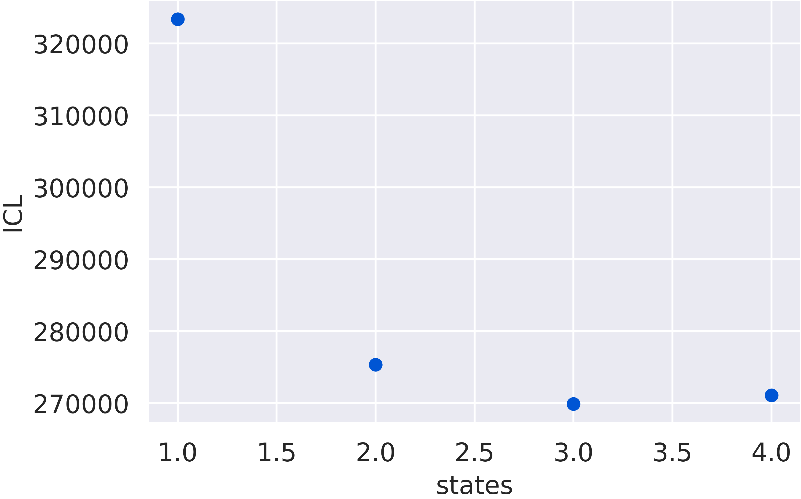
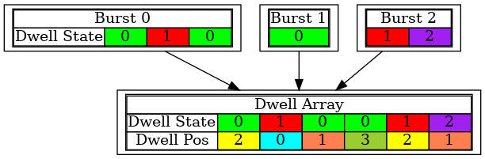

Access the results of an optimization
=====================================

Accessing results
-----------------

|H2MM| is at its core an optimization algorithm.
The underlying algorithm finds the most likely model for a predetermined number of states.
It is the user who is responsible for comparing optimized models with different numbers of states and selecting the ideal model.

.. note::
    For this tutorial, we will assume the following code has been executed prior to all given code snippets (this come from the :ref:`tutorial <tuthidden>`)::

        # import statements
        import numpy as np
        from matplotlib import pyplot as plt
        import fretbursts as frb
        import burstH2MM as hmm
        sns = frb.init_notebook()
        # path to your file
        filename = 'your_file.hdf5'
        # load data into fretbursts
        # load the data into the data object frbdata
        frbdata = frb.loader.photon_hdf5(filename)
        frb.loader.alex_apply_period(frbdata)
        # calculate background counts
        frbdata.calc_bg(frb.bg.exp_fit, F_bg=1.7)
        # now perform burst search
        frbdata.burst_search(m=10, F=6)
        # make sure to set the appropriate thresholds of ALL size
        # parameters to the particulars of your experiment
        frbdata_sel = frbdata.select_bursts(frb.select_bursts.size, th1=50)
        # now make the BurstData object
        bdata = hmm.BurstData(frbdata_sel)
        bdata.models.calc_models()

|calc_models| is designed to streamline this process, which optimizes models until the ideal model is found (it actually calculates one more than necessary because it must see that there is at least one model with too many models).

So before |calc_models| is called on an |H2MM_list| object, it has no optimizations associated with it.
After |calc_models| is called, then several different state models are stored in the |opts| attribute, but are also accesible by indexing |H2MM_list|.

>>> bdata.models[0]
AssertionError: No optimizations run, must run calc_models or optimize for H2MM_result objects to exist

So, we first need to run |calc_models| and we can now access the indices.

>>> bdata.models.calc_models()
The model converged after 2 iterations
The model converged after 36 iterations
The model converged after 125 iterations
The model converged after 405 iterations
>>> bdata.models[0]
<burstH2MM.BurstSort.H2MM_result at 0x7f0ebed12eb0>

The elements within |H2MM_list| are, as you see above, |H2MM_result| objects.
These serve to organize both the optimized models, and various results we will discuss later in this section.
But the first thing to examine are the statistical discriminators.
These take the loglikelihood of the model given the data, and add penalties for the number of states.
There are 2 primary discriminators:

#. BIC: the Bayes Information Criterion
    - Based on the likelihood of the model over all possible paths through the data, usually found to always improve with more states, and therefore less usefull
#. ICL: the Integrated Complete Likelihood
   - Based on the likelihood of the most likely state path through the data. Usually is minimized for the ideal state-model, and therefore the prefered statistical discriminator to use.

In both cases, the smaller the better.
Since these are computed for each optimized model, each |H2MM_result| object (index of |H2MM_list|), has an attribute to get this value.
However, since these values are generally only useful in relation to other models optimized against the same data, the |H2MM_result object has its own attribute to return an array with the values of all the optimized models:

#. BIC:
    - |result_bic|

        >>> bdata.models[0].bic
        323390.7888996974

    - |list_bic|

        >>> bdata.models.BIC
        array([323390.7888997 , 274041.04580956, 266584.73431314, 265800.67189548])

#. ICL:
    - |result_icl|

        >>> bdata.models[0].icl
        323390.78889956

    - |list_icl|

        >>> bdata.models.ICL
        array([323390.78889956, 275340.11281888, 269885.74672888, 271100.67269877])

burstH2MM has an easy way to compare these::

    # give ICL_plot a H2MM_list object
    hmm.ICL_plot(bdata.models)

Note that we do not index `bdata.models` because this is comparing the different state models, not looking at a single model.

So now that we know how to select the model, what actually composes a |H2MM| model?
There are three key components:

#. Initial probability matrix (the *.prior* matrix)
    - The likelihood of a burst beginning in a given state
#. Observation probability matrix (the *.obs* matrix)
    - Contains probability a given state will emit a photon in a given index, from this the E and S values can be calculated.
#. Transition probability matrix (the *.trans* matrix)
    - The rate at which each state transitions to the others. This indicates the rate of transitions, characterizing the thermodynamic stability of each state (assuming you are using a model that has an appropriate number of states, over and underfit models will obviously have transition rates not reflective of the actual dynamics).

.. note::

    Note that the attribute names for the statistical discriminators from |H2MM_list| object use captital letters, while |H2MM_result| objects are use lowercase letters.

The initial probability matrix does not have a clear physical meaning, but the observation probability and transition probability matrices contain very valuable information.
burstH2MM automatically converts the values in these from the abstract units of the core algorithm into more human-friendly units (E/S values and transition rates in seconds).

E and S can be accessed with the attributes |model_E| and |model_S|

>>> bdata.models[2].E
array([0.66031034, 0.15955158, 0.06730048])

>>> bdata.models[2].E
array([0.43073408, 0.55348988, 0.9708039 ])

The above values are the raw values, if you want to have them corrected for leakage, direct excitation, and the beta and gamma values, you can access them by adding `_corr` to the attribute name, to get |model_E_corr| and |model_S_corr|

The transition rates are accessed through the |model_trans| attributes.

>>> bdata.models[2].trans
array([[1.99994147e+07, 5.31727465e+02, 5.35447960e+01],
       [2.05278839e+02, 1.99996914e+07, 1.03279378e+02],
       [7.90898846e+00, 1.16271335e+02, 1.99998758e+07]])

These are in s\ :sup:`-1`\  and teh organization is [from state, to state]. Notice that the diagonal is all very large values, this is because the diagonal represents the probability that the system remains in the same state from one time step to the next, as the time steps are in the clock rate of the acquisiation (typically 20 mHz, meaning 50 ns from one time step to the next) this is a very large number.

Now |H2MM| also contains the *Viterbi* algorithm, which takes the data and optimized model, and finds the most likely state of each photon.
burstH2MM continues to perform analysis on this state path to produce a number of usefull parameters to help understand the data.

Table of attributes
-------------------

Below is a list and desciption of the different possible parameters and their descriptions.

+----------------------+----------------------------------------------------------------+---------------+
| Attribute            | Description                                                    | Type          |
+----------------------+----------------------------------------------------------------+---------------+
| |nanohist|           | Number of photons in each state and TCSPC bin                  | state stream  |
|                      |                                                                | nanotime      |
|                      |                                                                | array         |
+----------------------+----------------------------------------------------------------+---------------+
| |burst_state_counts| | Counts per dwell of states present within bursts               | state burst   |
|                      |                                                                | aray          |
+----------------------+----------------------------------------------------------------+---------------+
| |burst_type|         | Bininary code specifying the state present within each burst   | burst array   |
+----------------------+----------------------------------------------------------------+---------------+
| |trans_locs|         | The location of transitions with bursts                        | burst list    |
+----------------------+----------------------------------------------------------------+---------------+
| |burst_dwell_num|    | Duration of each dwell (in ms)                                 | dwell array   |
+----------------------+----------------------------------------------------------------+---------------+
| |dwell_state|        | The state of each dwell                                        | dwell array   |
+----------------------+----------------------------------------------------------------+---------------+
| |dwell_pos|          | Numerical indicator of location within the                     | dwell array   |
|                      | burst of each dwell | dwell array                              |               |
+----------------------+----------------------------------------------------------------+---------------+
| |dwell_ph_counts|    | Number of photons in each stream and dwell                     | stream dwell  |
|                      |                                                                | array         |
+----------------------+----------------------------------------------------------------+---------------+
| |dwell_ph_counts_bg| | Background corrected number                                    | stream dwell  |
|                      | of photons in each stream and dwell                            | array         |
+----------------------+----------------------------------------------------------------+---------------+
| |dwell_E|            | Raw FRET efficiency (E\ :sup:`raw`\ ) of each dwell            | dwell array   |
+----------------------+----------------------------------------------------------------+---------------+
| |dwell_E_corr|       | Fully corrected FRET efficiency of each dwell (E)              | dwell array   |
+----------------------+----------------------------------------------------------------+---------------+
| |dwell_S|            | Raw stoichiometry (S\ :sup:`raw`\ ) of each dwell              | dwell array   |
+----------------------+----------------------------------------------------------------+---------------+
| |dwell_S_corr|       | Fully corrected stoichiometry of each dwell (S)                | dwell array   |
+----------------------+----------------------------------------------------------------+---------------+
| |dwell_nano_mean|    | Mean nanotime of each stream in each dwell                     | stream dwell  |
|                      |                                                                | array         |
+----------------------+----------------------------------------------------------------+---------------+

Meaning of "type" explainded in next section.

Understanding dwell array organization
--------------------------------------

Data in dwell attributes (those that begin with "dwell") are orgnized into numpy arrays.
As diagramed in the figure below, the dwells are placed in the same order that they in the data.
This means the consecutive dwells indicate a transition from one state to another.
However, when one bursts ends, it is generally unreasonable to consider the dwell in the next burst to be considered a transition.
Hence, special consideration needs to be given for bursts at the start and end of bursts, as well as for bursts which contain only a single state, which is still counted as a dwell.
Since these are still incldued in the dwell arrays, the position of a burst within a dwell is recorded in the |dwell_pos| paremeter.

As seen, dwells in the middle of burst are marked with a 0 in |dwell_pos|, end with a 1, beginning with a 2 and bursts that span the whole dwell are marked with a 3.
The size of |dwell_pos| and other dwell array parameters match, and therefore |dwell_pos| can be used to make masks to select only dwells in one of the possible positions.

For instance if you want to get the E values of only dwells that are in the middle of bursts, excluding beginning, ending and whole burst dwells, you could execute the following::

    mid_dwell_mask = bdata.models[2].dwell_pos == 0
    mid_dwell_E = bdata.models[2].dwell_E[mid_dwell_mask]

Now some of the dwell parameters have extra dimensions, like |dwell_nano_mean|, where the mean nanotime is calculate *per stream* in addition to *per dwell*.
Therefore, it is a 2D array, with the last dimension marking the dwell.

.. note::

    Make sure to set the |irf_thresh| parameter before accessign |dwell_nano_mean|::

        bdata.irf_thresh = np.array([2355, 2305, 220])

So, to get the mean nanotimes of the mid-burst dwells, we would execute the following::

     mid_dwell_mask = bdata.models[2].dwell_pos == 0
     mid_dwell_nano_mean = bdata.models[2].dwell_nano_mean[:, mid_dwell_mask]

Of course, you probably want to look at just on photon stream's nanomean, more often than not this will be the |DD| stream, which for this data is the 0th stream.
So to get this we would execute the following::

     mid_dwell_mask = bdata.models[2].dwell_pos == 0
     mid_dwell_nano_mean_DD = bdata.models[2].dwell_nano_mean[0, mid_dwell_mask]

You could also isolate a particular state using the |dwell_state| parameter to make another mask::

     mid_dwell_mask = bdata.models[2].dwell_pos == 0
     state1_mask = bdata.models[2].dwell_state == 1
     comb_mask = mid_dwell_mask * state1_mask
     state1_mid_nano_mean_DD = bdata.models[2].dwell_nano_mean[0, comb_mask]

Thus you can have a great deal of customization.

Example: Calcualte variance of state 1 dwell E values
*****************************************************

Let's put this into practice.
Let's say you want to know how tightly a given state's dwell cluster around a given value.
The steps would be simple:

#. Make mask of dwells in that state
#. Get E values of those dwells using mask
#. Calculate standard deviation (or whatever other value is of interest)

So lets see this in code:

>>> # make mask of dwells in state 1
>>> state1_mask = bdata.models[2].dwell_state == 1
>>> # get E values
>>> state1_E = bdata.models[2].dwell_E[state1_mask]
>>> # calcualte standard deviation
>>> np.nanstd(state1_E)
0.1233685488891

.. note::

    We used np.nanstd, as dwells with no |DD| or |DA| photons will have nan values, so we must exclude them to get a result that is not nan

.. _maskexplanation:

Using masking functions to make masks
*************************************

burstH2MM also provides a set of masking functions in :mod:`burstH2MM.Masking`.
They are named descriptively, and simply take a |H2MM_list| object as input.
So we can get the mid dwell mask like this::

    mid_dwell_mask = hmm.mid_dwell(bdata.models[2])

These functions can be used to filter which dwells are shown in various plotting functions, which is their primary use in burstH2MM. See :ref:`dwellposplot` for a demonstration of thier use in plotting.

.. _burstarrays:

Burst Based Arrays
------------------

In the list of attributes, you will notice two *burst* as opposed to *dwell* based attributes |burst_state_counts| and |burst_type|

These arrays are based not on dwells, but on the bursts instead. |burst_state_counts| is the larger, but ironically easier to understand of these arrays. Going down the rows, you go through different states, each element indicating the number of dwells in that state, each column a different state.

>>> bdata.models[2].burst_state_counts
array([[0, 2, 0, ..., 0, 0, 0],
       [0, 3, 0, ..., 0, 0, 1],
       [1, 0, 1, ..., 1, 1, 1]])

So for instance, the |burst_state_counts|[1,23] will tell you how many dwells there were in state 1 burst 23.

|burst_type| is essentially a simplification of |burst_state_counts| where it no longer matters how many dwells in a given state are present, just whether there is *at least one instance* of that state.
It represents this in a binary form, so a burst with only State0 will take the value `0b1`, only State1 `0b10`, and a dwell with transitions between State0 and State1 will be represented as `0b11`.
Of course, python usually doesn't display things in binary, so these will become `1`, `2` and `3` when acutally displayed.

>>> bdata.models[2].burst_type
array([4, 3, 4, ..., 4, 4, 6])

.. seealso:: :ref:`burstbasedplotting`

.. |H2MM| replace:: H\ :sup:`2`\ MM
.. |DD| replace:: D\ :sub:`ex`\ D\ :sub:`em`
.. |DA| replace:: D\ :sub:`ex`\ A\ :sub:`em`
.. |AA| replace:: A\ :sub:`ex`\ A\ :sub:`em`
.. |BurstData| replace:: :class:`BurstData <burstH2MM.BurstSort.BurstData>`
.. |div_models| replace:: :attr:`BurstData.div_models <burstH2MM.BurstSort.BurstData.div_models>`
.. |auto_div| replace:: :meth:`BurstData.auto_div() <burstH2MM.BurstSort.BurstData.auto_div>`
.. |new_div| replace:: :meth:`BurstData.new_div() <burstH2MM.BurstSort.BurstData.new_div>`
.. |irf_thresh| replace:: :attr:`BurstData.irf_thresh <burstH2MM.BurstSort.BurstData.irf_thresh>`
.. |H2MM_list| replace:: :class:`H2MM_list <burstH2MM.BurstSort.H2MM_list>`
.. |divisor_scheme| replace:: :attr:`H2MM_list.divisor_scheme <burstH2MM.BurstSort.H2MM_list.divisor_scheme>`
.. |list_bic| replace:: :attr:`H2MM_list.BIC <burstH2MM.BurstSort.H2MM_list.BIC>`
.. |list_bicp| replace:: :attr:`H2MM_list.BICp <burstH2MM.BurstSort.H2MM_list.BICp>`
.. |list_icl| replace:: :attr:`H2MM_list.ICL <burstH2MM.BurstSort.H2MM_list.ICL>`
.. |calc_models| replace:: :meth:`H2MM_list <burstH2MM.BurstSort.H2MM_list.calc_models>`
.. |opts| replace:: :attr:`H2MM_list.opts <burstH2MM.BurstSort.H2MM_list.opts>`
.. |H2MM_result| replace:: :class:`H2MM_result <burstH2MM.BurstSort.H2MM_result>`
.. |trim_data| replace:: :meth:`H2MM_result.trim_data() <burstH2MM.BurstSort.H2MM_result.trim_data>`
.. |model_E| replace:: :attr:`H2MM_result.E <burstH2MM.BurstSort.H2MM_result.E>`
.. |model_E_corr| replace:: :attr:`H2MM_result.E_corr <burstH2MM.BurstSort.H2MM_result.E_corr>`
.. |model_S| replace:: :attr:`H2MM_result.S <burstH2MM.BurstSort.H2MM_result.S>`
.. |model_S_corr| replace:: :attr:`H2MM_result.S_corr <burstH2MM.BurstSort.H2MM_result.S_corr>`
.. |model_trans| replace:: :attr:`H2MM_result.trans <burstH2MM.BurstSort.H2MM_result.trans>`
.. |nanohist| replace:: :attr:`H2MM_result.nanohist <burstH2MM.BurstSort.H2MM_result.nanohist>`
.. |burst_state_counts| replace:: :attr:`H2MM_result.burst_state_counts <burstH2MM.BurstSort.H2MM_result.burst_state_counts>`
.. |burst_type| replace:: :attr:`H2MM_result.burst_type <burstH2MM.BurstSort.H2MM_result.burst_type>`
.. |dwell_pos| replace:: :attr:`H2MM_result.dwell_pos <burstH2MM.BurstSort.H2MM_result.dwell_pos>`
.. |dwell_dur| replace:: :attr:`H2MM_result.dwell_dur <burstH2MM.BurstSort.H2MM_result.dwell_dur>`
.. |dwell_state| replace:: :attr:`H2MM_result.dwell_state <burstH2MM.BurstSort.H2MM_result.dwell_state>`
.. |dwell_ph_counts| replace:: :attr:`H2MM_result.dwell_ph_counts <burstH2MM.BurstSort.H2MM_result.dwell_ph_counts>`
.. |dwell_ph_counts_bg| replace:: :attr:`H2MM_result.dwell_ph_counts_bg <burstH2MM.BurstSort.H2MM_result.dwell_ph_counts_bg>`
.. |dwell_E| replace:: :attr:`H2MM_result.dwell_E <burstH2MM.BurstSort.H2MM_result.dwell_E>`
.. |dwell_E_corr| replace:: :attr:`H2MM_result.dwell_E_corr <burstH2MM.BurstSort.H2MM_result.dwell_E_corr>`
.. |dwell_S| replace:: :attr:`H2MM_result.dwell_S <burstH2MM.BurstSort.H2MM_result.dwell_S>`
.. |dwell_S_corr| replace:: :attr:`H2MM_result.dwell_S_corr <burstH2MM.BurstSort.H2MM_result.dwell_S_corr>`
.. |burst_dwell_num| replace:: :attr:`H2MM_result.burst_dwell_num <burstH2MM.BurstSort.H2MM_result.burst_dwell_num>`
.. |dwell_nano_mean| replace:: :attr:`H2MM_result.dwell_nano_mean <burstH2MM.BurstSort.H2MM_result.dwell_nano_mean>`
.. |trans_locs| replace:: :attr:`H2MM_result.trans_locs <burstH2MM.BurstSort.H2MM_result.trans_locs>`
.. |result_bic| replace:: :attr:`H2MM_result.bic <burstH2MM.BurstSort.H2MM_result.bic>`
.. |result_bicp| replace:: :attr:`H2MM_result.bicp <burstH2MM.BurstSort.H2MM_result.bicp>`
.. |result_icl| replace:: :attr:`H2MM_result.icl <burstH2MM.BurstSort.H2MM_result.icl>`
.. |dwell_ES_scatter| replace:: :func:`dwell_ES_scatter() <burstH2MM.Plotting.dwell_ES_scatter>`
.. |dwell_tau_hist| replace:: :func:`dwell_tau_hist() <burstH2MM.Plotting.dwell_tau_hist>`
.. |dwell_E_hist| replace:: :func:`dwell_E_hist() <burstH2MM.Plotting.dwell_E_hist>`
.. |raw_nanotime_hist| replace:: :func:`raw_nanotime_hist <burstH2MM.Plotting.raw_nanotime_hist>`
