.. _controlplot:

Control plotting functions
==========================

.. note::
    For this tutorial, we will assume the following code has been executed prior to all given code snippets (this come from the :ref:`tutorial <tuthidden>`)::

        # import statements
        import numpy as np
        from matplotlib import pyplot as plt
        import fretbursts as frb
        import burstH2MM as hmm
        sns = frb.init_notebook()
        # path to your file
        filename = 'your_file.hdf5'
        # load data into fretbursts
        # load the data into the data object frbdata
        frbdata = frb.loader.photon_hdf5(filename)
        frb.loader.alex_apply_period(frbdata)
        # calculate background counts
        frbdata.calc_bg(frb.bg.exp_fit, F_bg=1.7)
        # now perform burst search
        frbdata.burst_search(m=10, F=6)
        # make sure to set the appropriate thresholds of ALL size
        # parameters to the particulars of your experiment
        frbdata_sel = frbdata.select_bursts(frb.select_bursts.size, th1=50)
        # now make the BurstData object
        bdata = hmm.BurstData(frbdata_sel)
        bdata.models.calc_models()

Customizing state plotting
--------------------------

The central plotting functions of burstH2MM are all highly customizable.

The first and simplest form of customization is using the `ax` keyword argument, which is universal to all plotting functions.
This lets you make a `matplotlib axes <mpl_ax>`_ (usually made with `plt.subplots() <plt_subplots>`_ or related functions), and then plot all elements within that axes.
This also lets overlaping differnt plots into one axes.

So here's an example, and we'll set the title of the axes afterward::

    # make the axes
    fig, ax = plt.subplots(figsize=(5,5))
    hmm.dwell_ES_scatter(bdata.models[2], ax=ax)
    ax.set_title("Dwell Based Results")

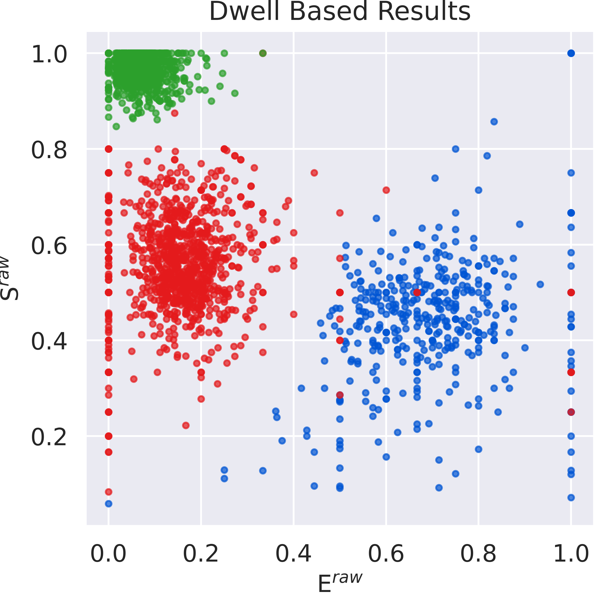

For E and S based parameters, there is the option to use the raw values (calcualted from the photons alone), or the values corrected for the values set for leakage, direct excitation, gamma and beta **that have been set in the fretbursts.Data** object used to create the |BurstData| object that you are working on.
For dwell based parameters, corrections for background are also applied.

This is done quite simply using the `add_correactions` keyword argument::

    fig, ax = plt.subplots(figsize=(5,5))
    # add correction factors (determine for your own setup)
    bdata.data.leakage = 0.0603
    bdata.data.dir_ex = 0.0471
    bdata.data.gamma = 1.8
    bdata.data.beta = 0.69
    # note the addition of add_corrections=True
    hmm.dwell_ES_scatter(bdata.models[2], add_corrections=True, ax=ax)
    # set limits on the values, since with corrections, some dwells with
    # few photons in a stream will have extreme values
    ax.set_xlim([-0.2, 1.2])
    ax.set_ylim([-0.2, 1.2])

.. image:: images/dwellESscatter_corr.png

.. note::

    See the :ref:`datacreation` section to understand how, and most importantly **when** parameters are calcualted
    Make sure that your leakage, dir_ex, gamma and beta values are set **before** you try to plot or otherwise access any dwell value that involves correcting for these factors.
    If you want to recalculate, that is possible, use the |trim_data| method on your |H2MM_result| object to clear the value::

        bdata.models[2].trim_data()

        fig, ax = plt.subplots(figsize=(5,5))
        # add correction factors (determine for your own setup)
        bdata.data.leakage = 0.0603
        bdata.data.dir_ex = 0.0471
        bdata.data.gamma = 1.8
        bdata.data.beta = 0.69
        #note the addition of add_corrections=True
        hmm.dwell_ES_scatter(bdata.models[2], add_corrections=True, ax=ax)

    This will ensure that the values are recalculated with the proper correction factors.

.. _by_state:

Customizing plots by state
--------------------------

Additional customizations focus on how states are individually plotted.
This is done by passing lists of keyword argument dictionaries to specific keyword argumnets.

The first of these keyword arguments we will explore is `state_kwargs`.
This is universall to all plotting functions begining with `dwell_`.
For it you pass a list of dictionaries of keyword arguments for the underlying matploplib function, one dictionary for each state.

Confusing, here's a simple example, where we assign a color to each state in the |dwell_ES_scatter| plot::

    # set up list, same length as number of states in the model
    state_color = [{'color':'m'}, {'color':'yellow'}, {'color':'c'}]
    hmm.dwell_ES_scatter(bdata.models[2], state_kwargs=state_color)

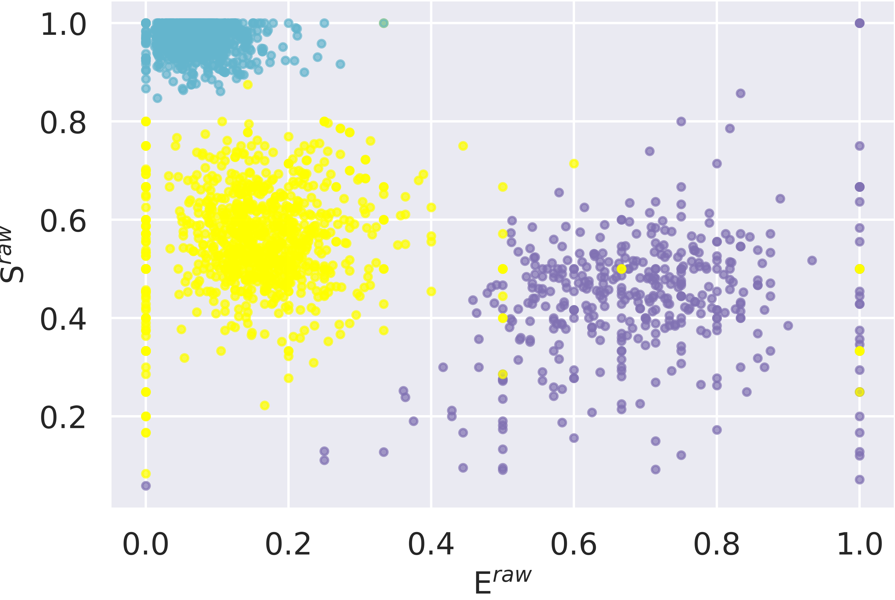

So what happened here?
Since models[2] has 3 states, the input `state_kwargs` keyword argument needs to be a list or tuple of length 3.
States in a model have an order, established in the model itself.
Each element of the list is passed, *per state* to the maptloib `scatter() <plt_scatter>`_ function as \*\*kwargs.
So the first state gets the keyword arguemtn `color='m'`, the second state `color='yellow'` and the third `color='m'`.

.. note::

    The different plotting functions use different matplotlib and seaborn functions.
    So plotting fucntions that create histograms use `plt.hist() <plt_hist>`_, while scatter functions use `plt.scatter() <plt_scatter>`_, and kde plot functions use `sns.kdeplot() <sns_kdeplot>`_

Only displaying certain states
------------------------------

What if you want to only look at a few states?
You can select, and control the order of the plotting of different states with the `states` keyword argument.

Let's say we want to only look at the FRET states (which are the 0th and 1st states in sample data set, but might be different when you are using other datasets).
To do this, we make an array of just the indices of those states, and then pass that array to the `states` keyword argument::

    # make the axes
    fig, ax = plt.subplots(figsize=(5,5))

    # specify the states we want
    states = np.array([0, 1])

    # now we plot
    hmm.dwell_ES_scatter(bdata.models[2], ax=ax, states=states)
    ax.set_title("FRET states")

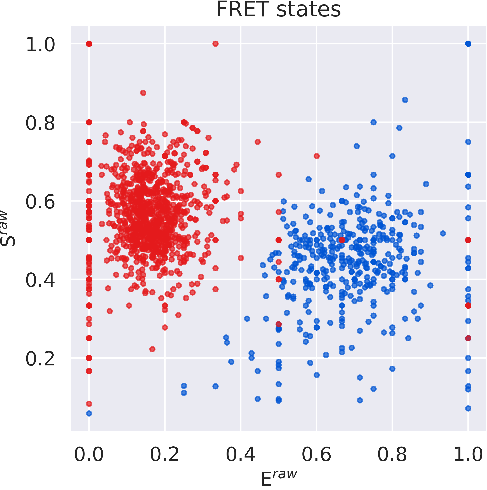

Selecting states and controlling their plotting
***********************************************

So how do we combine the `states` and `state_kwargs`?
It's pretty simple, `states` serves like a "master", and so each state specified in `states` is matched with an element of `state_kwargs`, assuming they come *in the same order*.
So, basicaly specify `state_kwargs` dictionaries in the same order as the states you specify in `states`, and obviously, they need to be the same length, otherwise you will get an error.

So here's an example where we re-plot the FRET states, but in reverse order, and see how the `state_kwargs` are also reorderd::

    # make the axes
    fig, ax = plt.subplots(figsize=(5,5))

    # specify the states we want, now with 1 before 0
    states = np.array([1, 0])
    # make the state_kwargs, we'll add labels this time
    state_kwargs = [{'color':'yellow', 'label':'FRET state 1'}, {'color':'m', 'label':'FRET state 2'}]

    # now we plot
    hmm.dwell_ES_scatter(bdata.models[2], ax=ax, states=states, state_kwargs=state_kwargs)

    # add title, and legend to the plot
    ax.set_title("FRET states")
    ax.legend()

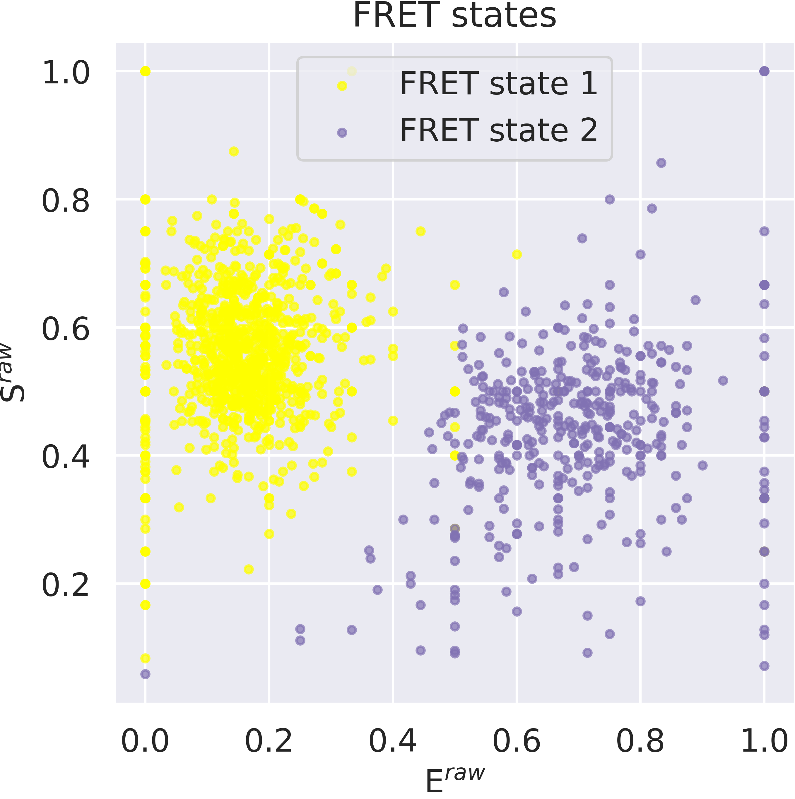

Selecting photon streams
------------------------

But what about the |dwell_nano_mean| parameter?
It has not only information per state, but also information per stream.
Some other dwell parameters are similar.
To select and/or specify a stream, we have the `streams` keyword argument, and the `stream_kwargs` keyword argument to customize those plotting for those functions as well.
For this we will use the |dwell_tau_hist| function.

.. note::

    Remember to set the |irf_thresh| ::

        bdata.irf_thresh = np.array([2355, 2305, 220])

So let's see the default appearance first::

    fig, ax = plt.subplots(figsize=(3, 5))
    hmm.dwell_tau_hist(bdata.models[2], ax=ax)

.. image:: images/dwellnthist.png

By default, |dwell_tau_hist| only shows the mean nanotimes for the |DD| photon stream.
But what if we wanted to look at a different stream?
To do this we use the `streams` keyword argument.
It functions like the :ref:`states <by_state>` keyword argument before.

So, let's look at the |DD| and |DA| streams::

    fig, ax = plt.subplots(figsize=(5, 3))
    streams = [frb.Ph_sel(Dex="Dem"), frb.Ph_sel(Dex="Aem")]
    hmm.dwell_tau_hist(bdata.models[2], ax=ax, streams=streams)

.. image: images/dwellnanomeanmulti.png

Or just the |DA| stream::

    fig, ax = plt.subplots(figsize=(5, 3))
    streams = [frb.Ph_sel(Dex="Aem")]
    hmm.dwell_tau_hist(bdata.models[2], ax=ax, streams=streams)

.. image: images/dwellnanomeanAA.png

Customizing plotting of photon streams
--------------------------------------

For plots where there are specific selections per stream in addition to per state, the `stream_kwargs` keyword argument extists.
It functions much like the `state_kwargs` argument, matching the order of `streams` and needing to be the same length.

Also, `state_kwargs` and `stream_kwargs` merge dictionaries, so you can specify both, and not have a problem.

So let's see an example::

    fig, ax = plt.subplots(figsize=(5, 3))
    streams = [frb.Ph_sel(Dex="Dem"), frb.Ph_sel(Dex="Aem")]
    stream_kw = [{'color':'b'}, {'color':'r'}]
    hmm.dwell_tau_hist(bdata.models[2], ax=ax, streams=streams, stream_kwargs=stream_kw)

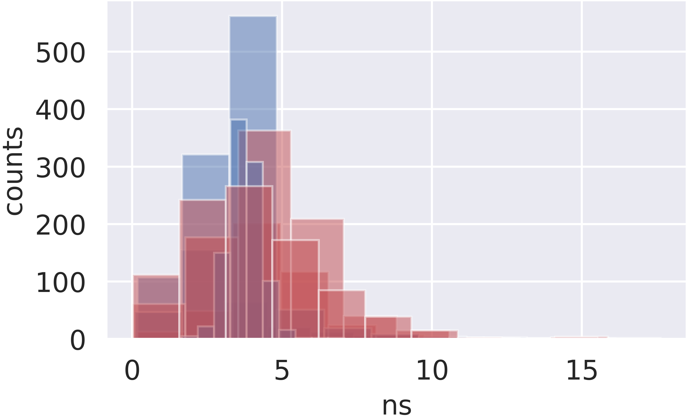

But now, the problem is we have no idea which state goes with what, so let's use the `states` keyword argument to specify only the 0th state::

    fig, ax = plt.subplots(figsize=(5, 3))
    streams = [frb.Ph_sel(Dex="Dem"), frb.Ph_sel(Dex="Aem")]
    stream_kw = [{'color':'b'}, {'color':'r'}]
    state = np.array([0])
    hmm.dwell_tau_hist(bdata.models[2], ax=ax, streams=streams, stream_kwargs=stream_kw, states=state)

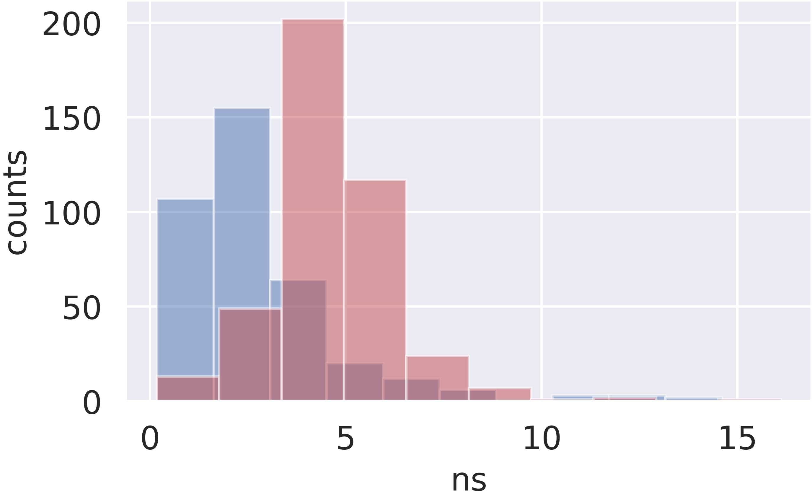

Finally, `stream_kwargs` and `state_kwargs` work together, the two dictionaries for a particular stream and state combination are merged::

    fig, ax = plt.subplots(figsize=(5, 3))
    streams = [frb.Ph_sel(Dex="Dem"), frb.Ph_sel(Dex="Aem")]
    stream_kw = [{'color':'b'}, {'color':'r'}]
    state_kw = [{'edgecolor':'darkblue'}, {'edgecolor':'darkorange'}, {'edgecolor':'olive'}]
    hmm.dwell_tau_hist(bdata.models[2], ax=ax, streams=streams, stream_kwargs=stream_kw, state_kwargs=state_kw)

.. note::

    In the dictionary merging process, if the same key is present in both dictionaries, then the value in `stream_kwargs` will be used, and the values in `state_kwargs` over-written.

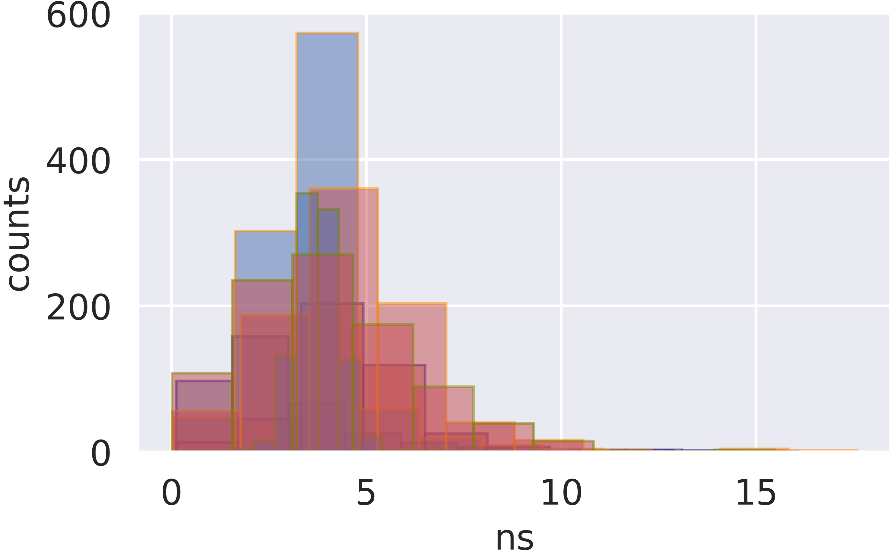

Plotting state and stream specific plotting in one array
--------------------------------------------------------

Now, sometimes you need even more control, because the two keyworkd argument arrays clash.
For this there is the `kwarg_arr` keyword argument.
In `kwarg_arr`, you provide an array of dictionaries that will be the keyword arguments for `scatter() <plt_scatter>`_, the outer dimention indicates which state, the inner, the stream.

.. note::

    `kwarg_arr` is mean to take the place of the combination of `state_kwargs` and `stream_kwargs`
    As such, if `kwarg_arr` and `state_kwargs` cannot be specified at the same time.
    If `stream_kwargs` is specified at the same time as `kwarg_arr`, then burstH2MM will make a check.
    If `kwarg_arr` is formated like `state_kwargs`, then it will be treated like `state_kwargs`.
    On the other hand, if it is formated as demosntrated below, `stream_kwargs` will be ignored, and a warning will be presented.

::

    fig, ax = plt.subplots(figsize=(6, 4))
    kwarr = [[{'color':'g', 'label':'State 0, DexDem'},
              {'color':'darkgreen', 'label':'State 0, DexDem'}],
             [{'color':'r', 'label':'State 1, DexDem'},
              {'color':'darkred', 'label':'State1, DexAem'}],
             [{'color':'b', 'label':'State 2, DexDem'},
              {'color':'darkblue', 'label':'State2, DexAem'}]]
    hmm.dwell_tau_hist(bdata.models[2], ax=ax, kwarg_arr=kwarr, streams=[frb.Ph_sel(Dex="Dem"), frb.Ph_sel(Aex="Aem")])
    ax.legend()

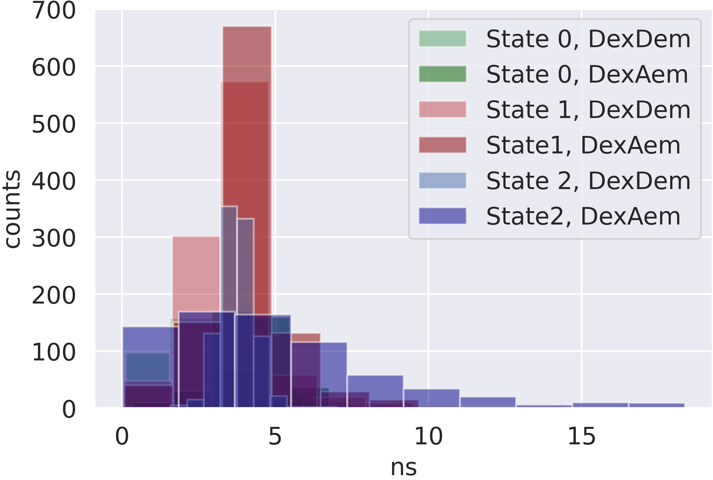

So `kwarg_arr` allows the most customization, but is also the longest to define.

.. _dwellposplot:

Plotting only dwells of certain position and other masking
----------------------------------------------------------

Dwell based plotting functions also include the `dwell_pos` keyword arguments.
This arguments allows the user to filter which dwells are plotted, not by state, but by the position (middle of the burst, start, stop or whole), and in its most advanced useage, by any user defined criterion.
There are several possible types of inputs to `dwell_pos`, but the most easily understood is by using one of the :mod:`Masking <Masking>` functions (see :ref:`maskexplanation` ).

So let's see `dwell_pos` in action::

    fig, ax = plt.subplots(figsize=(5,5))
    # plot only dwells in the middle of a burst
    hmm.dwell_ES_scatter(bdata.models[2], dwell_pos=hmm.mid_dwell, ax=ax)

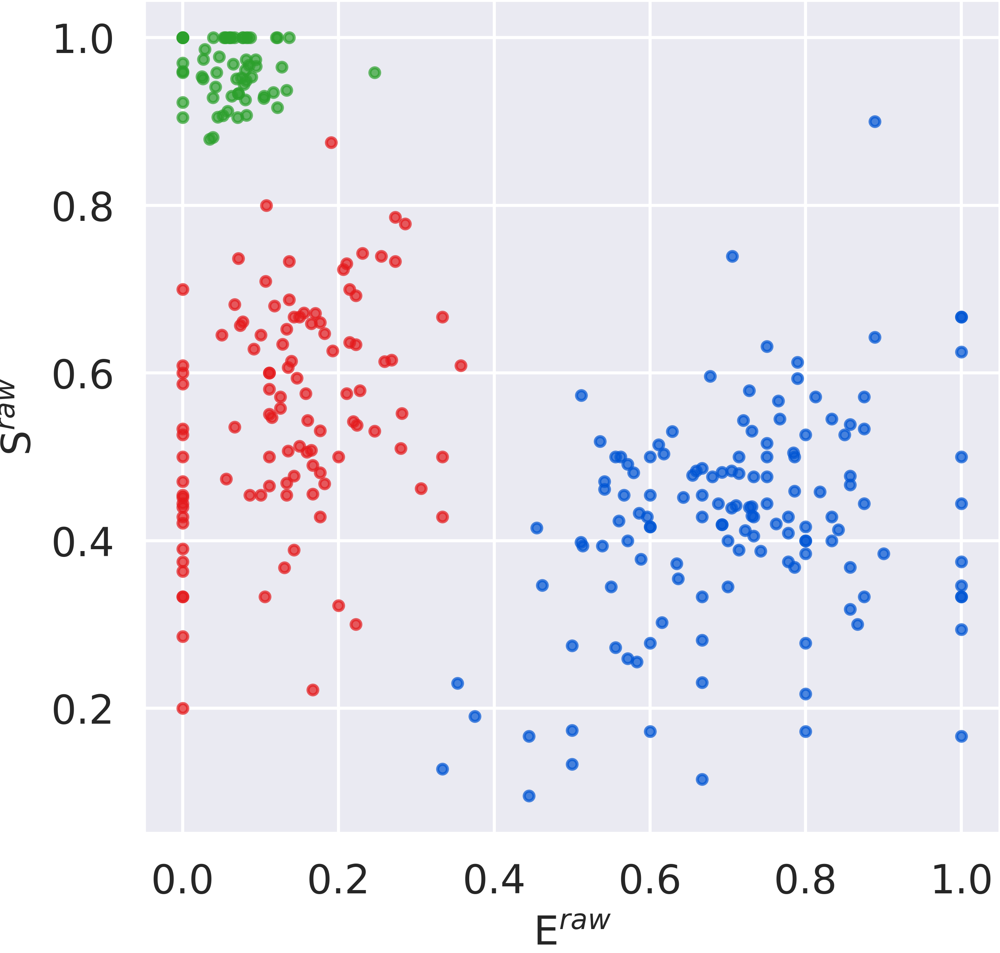

.. note::

    Functions handed to `dwell_pos` must accept a |H2MM_result| object as input, and return a mask of dwells

You will note many fewer points, as there are many beginning, ending and whole burst dwells removed.

It is also possible to specify dwells by specifying `dwell_pos` as an integer cooresponding to the dwell position code used in the similarly named |dwell_pos| parameter.

So to select the mid dwells, we give it 0::

    fig, ax = plt.subplots(figsize=(5,5))
    # plot only dwells in the middle of a burst
    hmm.dwell_ES_scatter(bdata.models[2], dwell_pos=1, ax=ax)

And to select the beginning of bursts::

    fig, ax = plt.subplots(figsize=(5,5))
    # plot only dwells in the middle of a burst
    hmm.dwell_ES_scatter(bdata.models[2], dwell_pos=2, ax=ax)

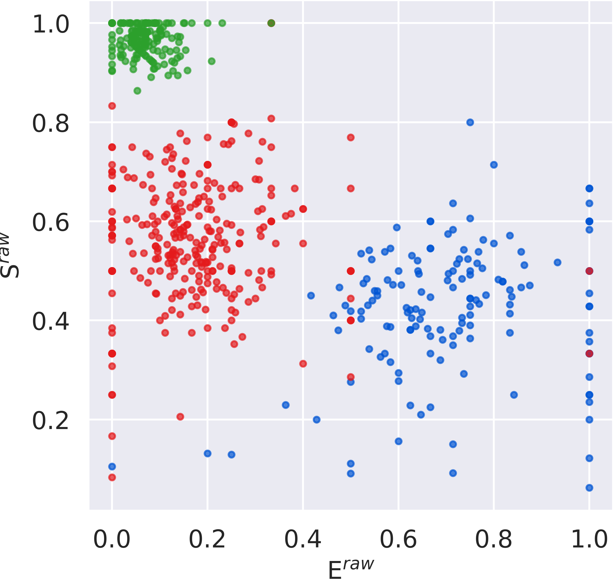

It is also possible to select multiple types of dwells by using an array of all interested codes::

    fig, ax = plt.subplots(figsize=(5,5))
    # make array of code selections (beginning and whole burst dwells)
    pos_sel = np.array([2,3])
    # plot the selection
    hmm.dwell_ES_scatter(bdata.models[2], dwell_pos=pos_sel, ax=ax)

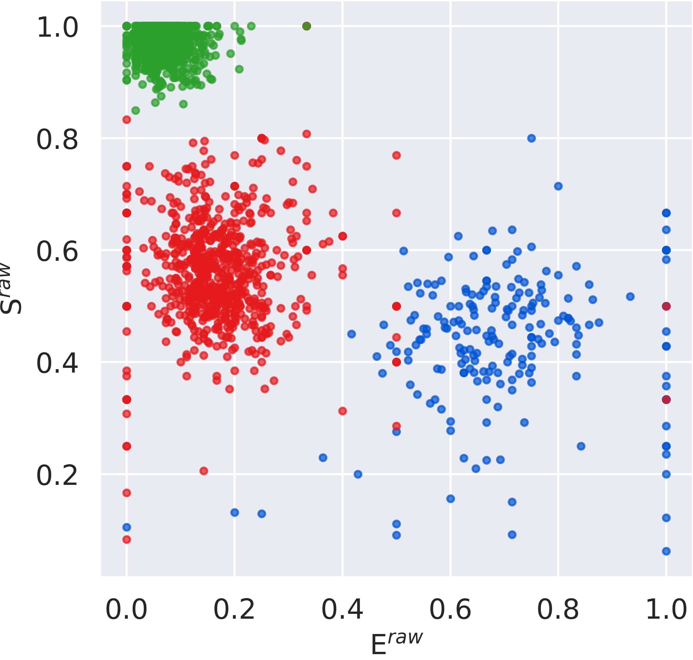

Another method is to provide a mask of all the dwells, for example, all dwells with a stoichiometry greater than some threshold::

    fig, ax = plt.subplots(figsize=(5,5))
    # make mask of dwells with stoichiometry greater than 0.5
    dwell_mask = bdata.models[2].dwell_S > 0.5
    # plot with a mask
    hmm.dwell_ES_scatter(bdata.models[2], dwell_pos=dwell_mask, ax=ax)
    # ensure full S range is plotted
    ax.set_ylim([0,1])

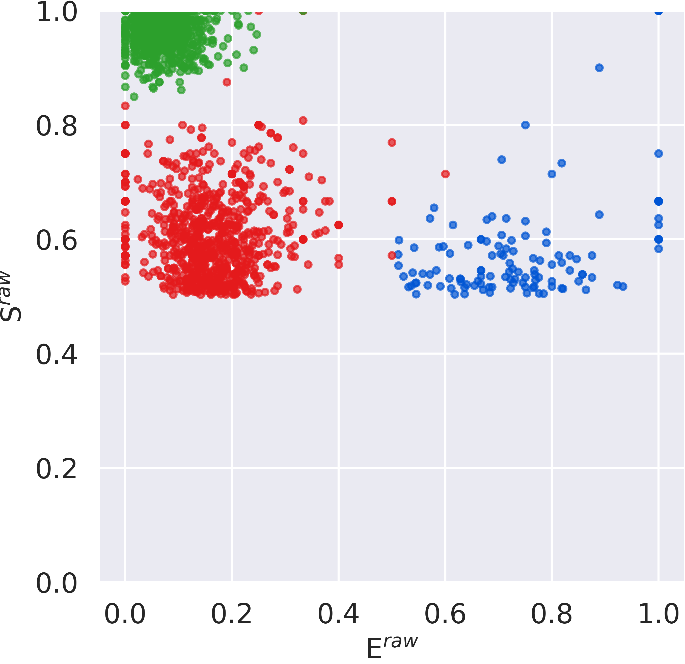

Now the previous example plots a selection that is not very useful, however, what if we want to exclude dwells with fewer than a certian number of photons?
Well, you could use |dwell_ph_counts| to make a mask, but there is one :mod:`Masking <Masking>` function that is different from the others, and will not work direclty as an input to `dwell_pos`: this is :func:`dwell_size() <Masking.dwell_size>` which needs at least a minimum number of photons as input.
So here, we will employ a Python `lambda` function::

    fig, ax = plt.subplots(figsize=(5,5))
    # plot with lambda function, sets ph_min at 10
    hmm.dwell_ES_scatter(bdata.models[2], dwell_pos= lambda m: hmm.dwell_size(m, 10), ax=ax)

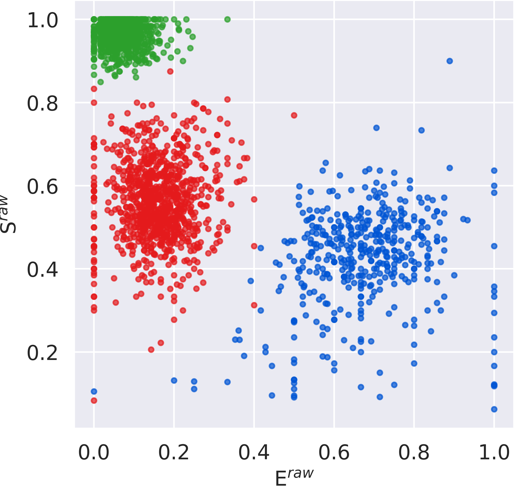

Thus you can hand functions that take |H2MM_result| object as input, and returns a mask as output to select dwells based on whatever parameters you want.

.. _burstbasedplotting:

Burst Based Plotting
--------------------

What if you want to look not at individual dwells, but at how bursts differe based on the bursts within them?
For that there are the burst-based plots.
There is currently 1 burst-based plotting function, but more are likely to come in future versions.
This is |burst_ES_scatter|

Now, instead of segmenting the data into dwells, we consider entire bursts, based on what states are present within them. Under the hood, this is achieved using the |burst_type| attribute. This means the plots will now have points at the same positions as FRETBursts plotting functions, but will gain additional formating depending on what states are present within them.

.. seealso:: :ref:`burstarrays`

So let's look at the basic plot produced from |burst_ES_scatter| ::

    fig, ax = plt.subplots(figsize=(5,5))
    hmm.burst_ES_scatter(bdata.models[2], ax=ax)

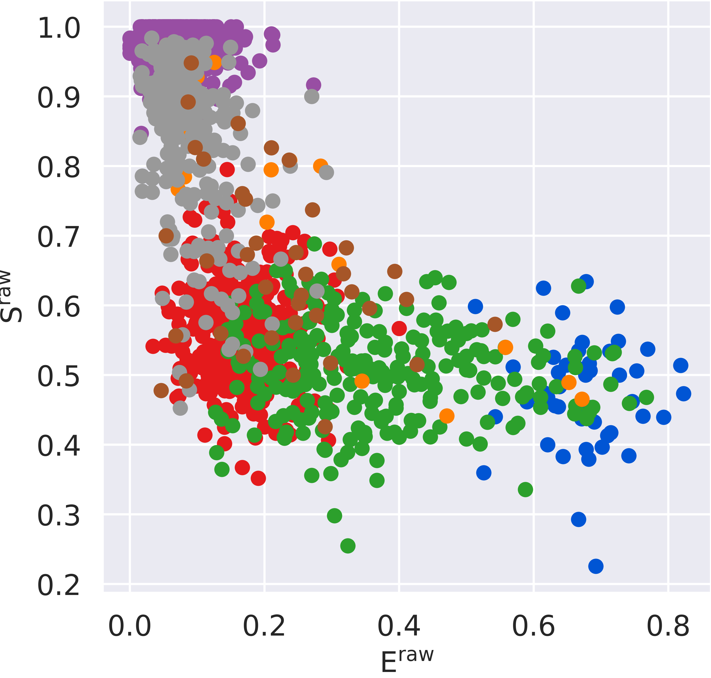

Now this plot has a lot of colors in it, and they aren't labeled. The number of colors scales with the square of the number of states, so you can imagine these plots get busy quickly. So there is an option: `flatten_dynamics`.
Set this to `True` and then bursts will only be distinguished by whether *any* sort of transition occurs or if they only contain a *single* dwell/state::

    fig, ax = plt.subplots(figsize=(5,5))
    hmm.burst_ES_scatter(bdata.models[2], flatten_dynamics=True,  ax=ax)   

Finally, if you want to control the plotting by burst type, much like the `state_kwargs` keyword argument, thre is the `type_kwargs` keyword argument.
So, what is the order that the list needs to be given? Well that depends on if `flatten_dynamics` is `True` or `False`.

If it is `False`, then the order is based on the binary order, so it will go State0 only, then State1 only, then State1 and State0, then State2 etc::

    fig, ax = plt.subplots(figsize=(5,5))
    type_kwargs = [
        {'label':'State 0'}, {'label':'State 1'},
        {'label':'State 0+1'}, {'label':'State 2'},
        {'label':'State 2+0'}, {'label':'State 2+1'},
        {'label':'State 2+1+0'}
    ]
    hmm.burst_ES_scatter(bdata.models[2],type_kwargs=type_kwargs, ax=ax)
    ax.legend()

..image:: images/burstscatterESlabel.png

If `True` then the order is simply State0, State1 ... then finally, the last element will be "dynamic" bursts, i.e. a burst with any sort of dynamics::

    fig, ax = plt.subplots(figsize=(5,5))
    type_kwargs = [
        {'label':'State 0'}, {'label':'State 1'},
        {'label':'State 2'}, {'label':'Dynamics'}
    ]
    hmm.burst_ES_scatter(bdata.models[2],flatten_dynamics=True, type_kwargs=type_kwargs, ax=ax)
    ax.legend()

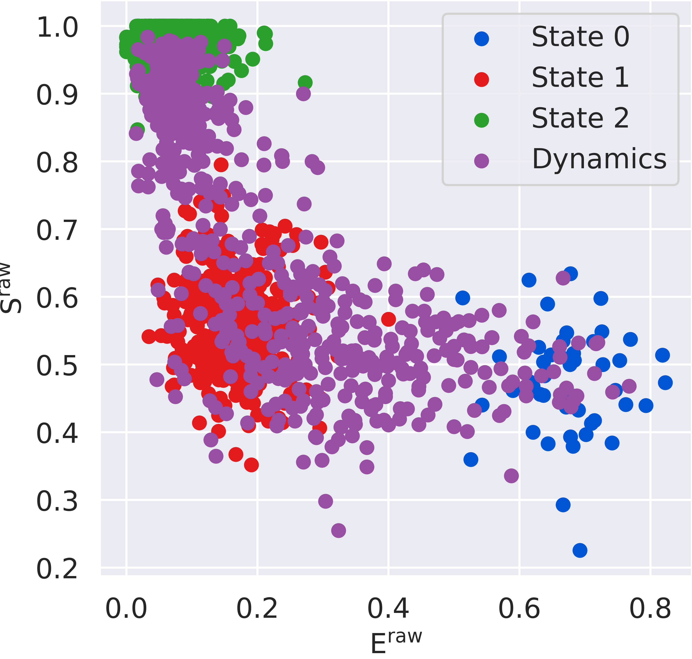

.. |H2MM| replace:: H\ :sup:`2`\ MM
.. |DD| replace:: D\ :sub:`ex`\ D\ :sub:`em`
.. |DA| replace:: D\ :sub:`ex`\ A\ :sub:`em`
.. |AA| replace:: A\ :sub:`ex`\ A\ :sub:`em`
.. |BurstData| replace:: :class:`BurstData <burstH2MM.BurstSort.BurstData>`
.. |div_models| replace:: :attr:`BurstData.div_models <burstH2MM.BurstSort.BurstData.div_models>`
.. |auto_div| replace:: :meth:`BurstData.auto_div() <burstH2MM.BurstSort.BurstData.auto_div>`
.. |new_div| replace:: :meth:`BurstData.new_div() <burstH2MM.BurstSort.BurstData.new_div>`
.. |irf_thresh| replace:: :attr:`BurstData.irf_thresh <burstH2MM.BurstSort.BurstData.irf_thresh>`
.. |H2MM_list| replace:: :class:`H2MM_list <burstH2MM.BurstSort.H2MM_list>`
.. |list_bic| replace:: :attr:`H2MM_list.BIC <burstH2MM.BurstSort.H2MM_list.BIC>`
.. |list_bicp| replace:: :attr:`H2MM_list.BICp <burstH2MM.BurstSort.H2MM_list.BICp>`
.. |list_icl| replace:: :attr:`H2MM_list.ICL <burstH2MM.BurstSort.H2MM_list.ICL>`
.. |calc_models| replace:: :meth:`H2MM_list <burstH2MM.BurstSort.H2MM_list.calc_models>`
.. |opts| replace:: :attr:`H2MM_list.opts <burstH2MM.BurstSort.H2MM_list.opts>`
.. |H2MM_result| replace:: :class:`H2MM_result <burstH2MM.BurstSort.H2MM_result>`
.. |trim_data| replace:: :meth:`H2MM_result.trim_data() <burstH2MM.BurstSort.H2MM_result.trim_data>`
.. |model_E| replace:: :attr:`H2MM_result.E <burstH2MM.BurstSort.H2MM_result.E>`
.. |model_E_corr| replace:: :attr:`H2MM_result.E_corr <burstH2MM.BurstSort.H2MM_result.E_corr>`
.. |model_S| replace:: :attr:`H2MM_result.S <burstH2MM.BurstSort.H2MM_result.S>`
.. |model_S_corr| replace:: :attr:`H2MM_result.S_corr <burstH2MM.BurstSort.H2MM_result.S_corr>`
.. |model_trans| replace:: :attr:`H2MM_result.trans <burstH2MM.BurstSort.H2MM_result.trans>`
.. |nanohist| replace:: :attr:`H2MM_result.nanohist <burstH2MM.BurstSort.H2MM_result.nanohist>`
.. |burst_state_counts| replace:: :attr:`H2MM_result.burst_state_counts <burstH2MM.BurstSort.H2MM_result.burst_state_counts>`
.. |burst_type| replace:: :attr:`H2MM_result.burst_type <burstH2MM.BurstSort.H2MM_result.burst_type>`
.. |dwell_pos| replace:: :attr:`H2MM_result.dwell_pos <burstH2MM.BurstSort.H2MM_result.dwell_pos>`
.. |dwell_dur| replace:: :attr:`H2MM_result.dwell_dur <burstH2MM.BurstSort.H2MM_result.dwell_dur>`
.. |dwell_state| replace:: :attr:`H2MM_result.dwell_state <burstH2MM.BurstSort.H2MM_result.dwell_state>`
.. |dwell_ph_counts| replace:: :attr:`H2MM_result.dwell_ph_counts <burstH2MM.BurstSort.H2MM_result.dwell_ph_counts>`
.. |dwell_ph_counts_bg| replace:: :attr:`H2MM_result.dwell_ph_counts_bg <burstH2MM.BurstSort.H2MM_result.dwell_ph_counts_bg>`
.. |dwell_E| replace:: :attr:`H2MM_result.dwell_E <burstH2MM.BurstSort.H2MM_result.dwell_E>`
.. |dwell_E_corr| replace:: :attr:`H2MM_result.dwell_E_corr <burstH2MM.BurstSort.H2MM_result.dwell_E_corr>`
.. |dwell_S| replace:: :attr:`H2MM_result.dwell_S <burstH2MM.BurstSort.H2MM_result.dwell_S>`
.. |dwell_S_corr| replace:: :attr:`H2MM_result.dwell_S_corr <burstH2MM.BurstSort.H2MM_result.dwell_S_corr>`
.. |burst_dwell_num| replace:: :attr:`H2MM_result.burst_dwell_num <burstH2MM.BurstSort.H2MM_result.burst_dwell_num>`
.. |dwell_nano_mean| replace:: :attr:`H2MM_result.dwell_nano_mean <burstH2MM.BurstSort.H2MM_result.dwell_nano_mean>`
.. |trans_locs| replace:: :attr:`H2MM_result.trans_locs <burstH2MM.BurstSort.H2MM_result.trans_locs>`
.. |result_bic| replace:: :attr:`H2MM_result.bic <burstH2MM.BurstSort.H2MM_result.bic>`
.. |result_bicp| replace:: :attr:`H2MM_result.bicp <burstH2MM.BurstSort.H2MM_result.bicp>`
.. |result_icl| replace:: :attr:`H2MM_result.icl <burstH2MM.BurstSort.H2MM_result.icl>`
.. |dwell_ES_scatter| replace:: :func:`dwell_ES_scatter() <burstH2MM.Plotting.dwell_ES_scatter>`
.. |dwell_tau_hist| replace:: :func:`dwell_tau_hist() <burstH2MM.Plotting.dwell_tau_hist>`
.. |dwell_E_hist| replace:: :func:`dwell_E_hist() <burstH2MM.Plotting.dwell_E_hist>`
.. |raw_nanotime_hist| replace:: :func:`raw_nanotime_hist <burstH2MM.Plotting.raw_nanotime_hist>`
.. |burst_ES_scatter| replace:: :func:`burst_ES_scatter <burstH2MM.Plotting.burst_ES_scatter>`

.. _plt_scatter: https://matplotlib.org/stable/api/_as_gen/matplotlib.pyplot.scatter.html
.. _mpl_ax: https://matplotlib.org/stable/api/axes_api.html#matplotlib.axes.Axes
.. _plt_subplots: https://matplotlib.org/stable/api/_as_gen/matplotlib.pyplot.subplots.html?highlight=subplots#matplotlib.pyplot.subplots
.. _plt_hist: https://matplotlib.org/stable/api/_as_gen/matplotlib.pyplot.hist.html
.. _sns_kdeplot: https://seaborn.pydata.org/generated/seaborn.kdeplot.html
