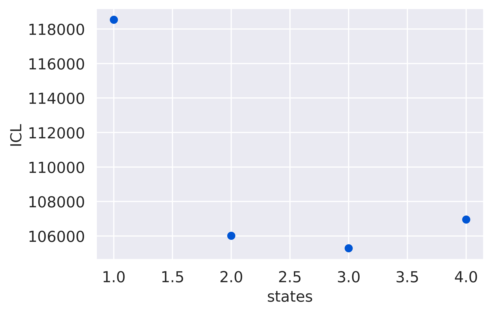
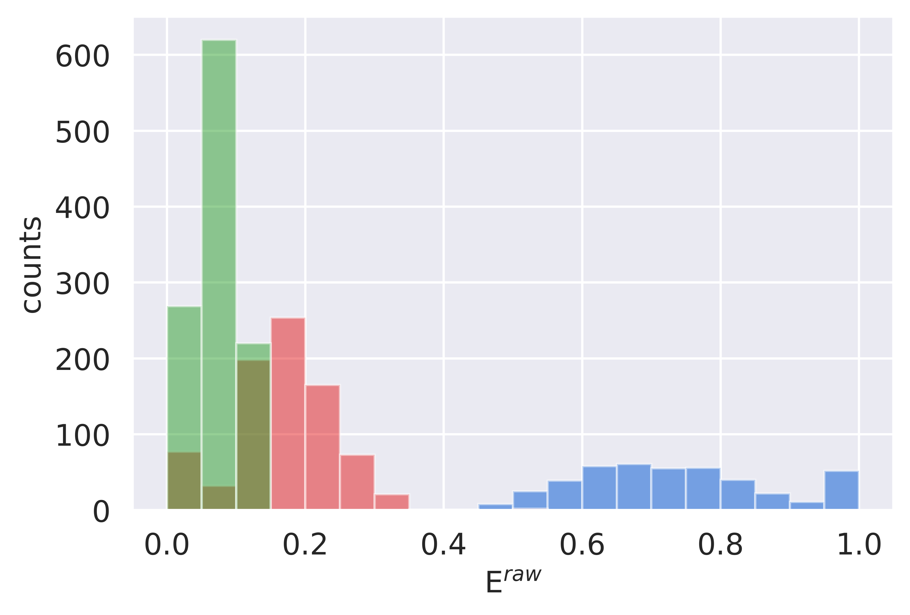
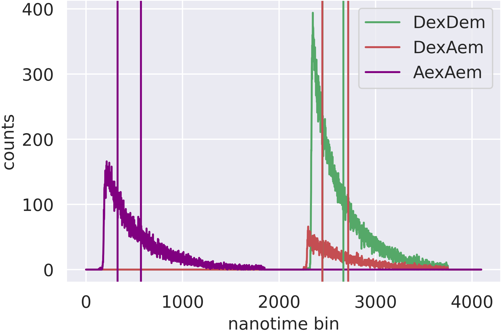
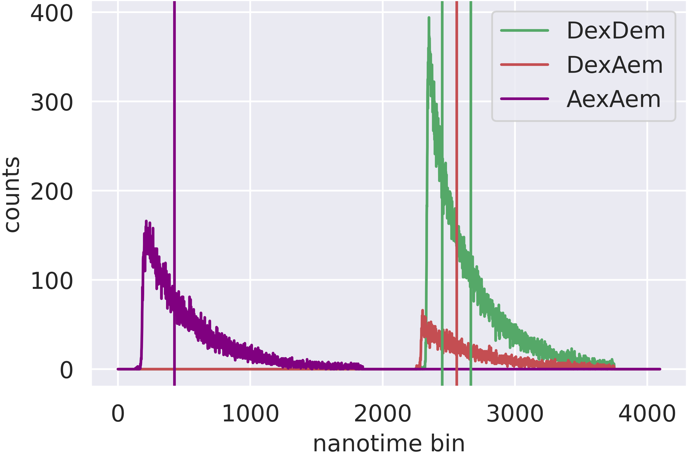
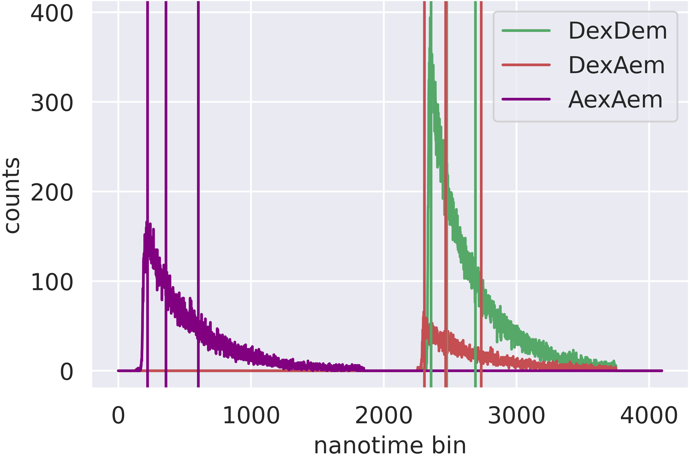
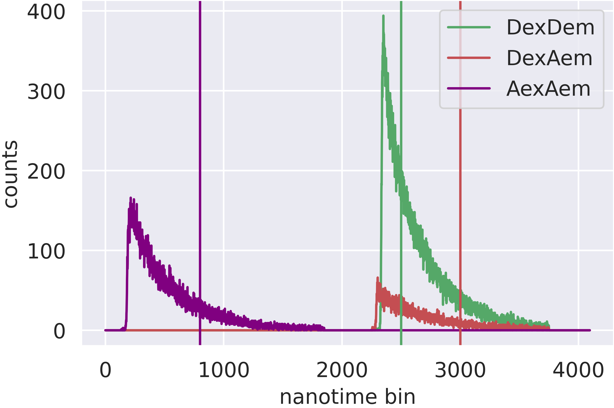

Customization
=============

.. currentmodule:: burstH2MM

.. note::
    For this tutorial, we will assume the following code has been executed prior to all given code snippets (this come from the :ref:`tutorial <tuthidden>`)::

        # import statements
        import numpy as np
        from matplotlib import pyplot as plt
        import fretbursts as frb
        import burstH2MM as hmm
        sns = frb.init_notebook()
        # path to your file
        filename = 'your_file.hdf5'
        # load data into fretbursts
        # load the data into the data object frbdata
        frbdata = frb.loader.photon_hdf5(filename)
        frb.loader.alex_apply_period(frbdata)
        # calculate background counts
        frbdata.calc_bg(frb.bg.exp_fit, F_bg=1.7)
        # now perform burst search
        frbdata.burst_search(m=10, F=6)
        # make sure to set the appropriate thresholds of ALL size
        # parameters to the particulars of your experiment
        frbdata_sel = frbdata.select_bursts(frb.select_bursts.size, th1=50)
        # now make the BurstData object
        bdata = hmm.BurstData(frbdata_sel)
        bdata.models.calc_models()
        # set irf_thresh since later in tutorial we will disucss nanotimes
        bdata.irf_thresh = np.array([2355, 2305, 220])

Caclulating Nanotimes with Confidence Threshold
-----------------------------------------------

By default, when calculating |nanohist| and |dwell_nano_mean|, all photons are considered.
However, not every photon is necessarily the best way to do this, as we can be more confident of some photon state assignments than others.
This comes by way of the |scale| parameter, which is a measure of the likelihood of the photon being in the state assigned by the *Viterbi* algorithm (it is one of the outputs of the *Viterbi* algorithm itself).
Now, it does not make sense to use this for calculating dwell duration, or even E/S values, as these are very much dependent on takign the **whole** dwell.
However, for nanotime parameters, some filtration could be useful (although in our tests, it has never made a significant difference, but we still wanted to provide the option).

.. note::
    The scale parameter is a *likelihood* parameter, therefore it is contained within the interval (0,1).
    Therefore confidence threshholds must also fall within the iterval [0,1).
    With setting 0 to indicate 

This can be done in two ways:
1. Using functions, without changing the stored parameter values
2. Using |conf_thresh|, which will change stored parameters |nanohist| and |dwell_nano_mean|

For option 1, the appropriately named functions |calc_nanohist| and |calc_dwell_nanomean| exist.
To set a threshold, use the keyword argument `conf_thresh` like so::

    # recalculate the nanotime histogram excluding photons with a scale value less than 0.3
    nanohist = hmm.calc_nanohist(bdata.models[2], conf_thresh=0.3)
    # calculate mean nanotimes of DexDem stream with same threshold
    dwell_nano_mean_dd = hmm.calc_dwell_nanomean(bdata.models[2], frb.Ph_sel(Dex='Dem'), 2355, conf_thresh=0.3)

.. note::

    The second argument of |calc_dwell_nanomean| is the desired photon stream.
    The third argument of |calc_dwell_nanomean| is the threshold for the IRF.
    You could also input `bdata.models[2].irf_thresh` and |calc_dwell_nanomean| will automatically choose the right threshold for the given photon stream.

Using option 2, you will only need to do the following::

    bdata.models[2].conf_thresh = 0.3

And the |nanohist| and |dwell_nano_mean| attributes of the |H2MM_result| attribute will be updated

.. note::

    The |conf_thresh| attribute is specific to each |H2MM_result|, so set each one you are interested in individually.
    This is because the distribution of likelihoods is not comparable for models with different numbers of states.
        
Customizing Photon Streams (mp vs sp |H2MM|)
--------------------------------------------

You may have noticed that in :ref:`controlplot` that when arrays are organized by photon stream, them always go in the order |DD|, |DA|, |AA|.
This is the default, but if
a. The data does not have alternating excitation or
b. You have explicitly specified when creating the |BurstData| object.

then the photon streams may not follow this pattern.

To check the order in which photon streams are specified, you can access the |ph_streams| attribute:

>>> bdata.ph_streams
(Ph_sel(Dex='Dem', Aex=None),
 Ph_sel(Dex='Aem', Aex=None),
 Ph_sel(Dex=None, Aex='Aem'))

This will always return a tuple of the actual order of photon streams for instance in the |nanohist| or |dwell_ph_counts| arrays.

So, what if for some reason you want to create a |BurstData| object with a different selection of photon streams?
For instance, if you know your |AA| stream will introduce undesireable behavior, or just want to compare, you can specify the `ph_streams` keyword argument with a list/tuple of the order of streams you want, defined using FRETBurst Ph_sel objects.

.. note::

    burstH2MM is smart, in calculating E and S values, it will do so correctly regarless of the order in which |ph_streams| is specified, because it automatically identifies which stream is which for the appropriate calculations.
    This also means that if there is no |AA| stream, then an error will be raised if you attempt to access a stoichiometry based value.

So let's demonstrate this, where we will perform |H2MM| in the original form, using only |DD| and |DA| streams::

    # make 2 stream BurstData
    spdata = hmm.BurstData(frbdata_sel, ph_streams=[frb.Ph_sel(Dex='Dem'), frb.Ph_sel(Dex='Aem')])
    # run optimization
    spdata.models.calc_models()
    # plot ICL to choose the best model
    hmm.ICL_plot(spdata.models)

    
Great! Now we can look at the dwell FRET histogram::

    hmm.dwell_E_hist(spdata.models[2])

Just be aware, if you try to get a stiochiometry based value (any of them!) you will get an error:

>>> hmm.dwell_ES_scatter(spdata.models[2])
AttributeError: Parent BurstData must include AexAem stream

.. _divlochowto:

Customizing divisors
--------------------

There are two methods for defining new :ref:`divisor schemes <divisor>`.

#. |auto_div| - high level method
#. |new_div| - low level method

.. note::

    |auto_div| acutally calls |new_div|, but simplifies the specification of divisors to the end user.

So let's see it in action::

    name = bdata.auto_div(2)

So where are the divisors in this system?
In all streams, there are 2 divisors (3 indices per stream), and they equally divide the nanotimes into these indices.

We can see the nanotimes of these divisors using the |divisor_scheme| attribute, and compare where they are relative to the nanotime decays.
We will use the |raw_nanotime_hist| to plot the nanotime decays, and place vertical lines at the positions of the divisors::

    fig, ax = plt.subplots()
    # plot histogram of nanotimes by stream
    hmm.raw_nanotime_hist(bdata, ax=ax)
    divs = bdata.div_models[name].divisor_scheme
    # plot vertical lines of divs
    hmm.axline_divs(bdata.div_models[name], ax=ax)

|auto_div| offers the option to add one more level of granularity::

    # make new divisor set
    name211 = bdata.auto_div([2,1,1])
    # now call same plotting code as before
    fig, ax = plt.subplots()
    # plot histogram of nanotimes by stream
    hmm.raw_nanotime_hist(bdata, ax=ax)
    # plot vertical lines of divs
    hmm.axline_divs(bdata.div_models[name211], ax=ax)

So what will this do?
Now, the number of divisors is specified *per stream*, meaning the |DD| stream will have 2 divisors, while the |DA| and |AA| streams will have only 1 divisor.
The even distribution of nanotimes between the divisors will however be maintained.

If you look at the documentation, you will notice that there is a keyword argument `include_irf_thresh`.
This adds a divisor to the already existing divisors, which is the threshhold set in |irf_thresh|.
So, if you call |auto_div| with `inlcude_irf_thresh=True`, there will be one extra divisor than if you had called it with `inlcude_irf_thresh=Fale` (the default).::

    bdata.irf_thresh = np.array([2355, 2305, 220])
    nameirf = bdata.auto_div(2, include_irf_thresh=True)
    # call same plotting code as before
    fig, ax = plt.subplots()
    hmm.raw_nanotime_hist(bdata, ax=ax)
    # plot vertical lines of divs
    hmm.axline_divs(bdata.div_models[nameirf], ax=ax)

Finally, |new_div| offers the greatest granularity, but also requires the most work by the user.
When using |new_div|, you must specify the nanotime divisors themselves.

The function call looks like this::

    divs = [np.array([2500]), np.array([3000]), np.array([800])]
    namecustom = bdata.new_div(divs)
    # call same plotting code as before
    fig, ax = plt.subplots()
    hmm.raw_nanotime_hist(bdata, ax=ax)
    divs = bdata.div_models[namecustom].divisor_scheme
    # plot vertical lines of divs
    hmm.axline_divs(bdata.div_models[namecustom], ax=ax)

Customizing optimizations
-------------------------

As a wrapper around `H2MM_C <H2MM_C>`, burstH2MM handles a lot of the inner details of working with  `H2MM_C <H2MM_C>` automatically, however, it does allow the user to override these defaults.

|calc_models| automatically optimizes several |H2MM| models, and the initial |H2MM| models used in those optmizations are provided in those optimizations.
If you have a look at the documenation, there also exists the |optimize| method, and its first argument is an :class:`H2MM_C.h2mm_model`, this method is the actual method that makes each |H2MM_result| object, and relies on :meth:`H2MM_C.h2mm_model.optimize` to optimize the input :class:`H2MM_C.h2mm_model`, which is the basis of the |H2MM_result| object.
|calc_models| actually calls |optimize| for each state model, and uses :func:`H2MM_C.factory_h2mm_model` to make the input models.

Using |optimize|
****************

So, if you want to control the initial models, you can use |optimize| instead like so::

    # we need to add H2MM_C to generate the models
    import H2MM_C as h2

    # make custom initial model
    prior = np.array([0.75, 0.25])
    trans = np.array([[1 - 1e-7, 1e-7],
                      [3e-7, 1 - 3e-7]])
    obs = np.array([[0.4, 0.1, 0.5],
                    [0.2, 0.3, 0.5]])
    init = h2.h2mm_model(prior, trans, obs)

    # now we can optimize with the custom model
    bdata.models.optimize(init)

|optimize| also allows passing the same keyword arguments as :meth:`H2MM_C.h2mm_model.optimize`, and thus the maxiumum number of iterations and other limits can be controlled in this same way.

For instance::

    prior = np.array([0.5, 0.25, 0.25])
    trans = np.array([[1 - 2e-7, 1e-7, 1e-7],
                      [2e-7, 1 - 3e-7, 1e-7],
                      [2e-7, 1e-7, 1 - 3e-7]])
    obs = np.array([[0.4, 0.1, 0.5],
                    [0.2, 0.3, 0.5],
                    [0.1, 0.1, 0.8]])
    init = h2.h2mm_model(prior, trans, obs)
    bdata.models.optimize(init, max_iter=7200)

.. note::

    .. _replace_kwarg:

    If a given state-model has already been optimized, you must specify the keyword argument `replace=True`::

        # this will not optimize if number of states already exists in H2MM_list
        bdata.models.optimize(init)
        # this cause the old optimization to be replaced
        bdata.models.optimize(init, max_iter=8000, replace=True)

Using |calc_models|
*******************

|calc_models| functions in essentially the same way.
*NOTE: the folloiwng code assumes only that the initializing code has been run, but not the examples using |optimize|, if the keyword arguments `replace=True` is not specified, then the existing optimizations will note be re-optimized.*
See the previous :ref:`note <replace_kwarg>`::

    bdata.models.calc_models(max_iter=7200)

So now all optimizations will run for a maximum of 7200 iterations instead of the default of 3600.

You can even specify initial models using |calc_models|, using the `models` keyword argument.
For this, simply hand `models` a list of :class:`H2MM_C.h2mm_model` objects.
|calc_models| will then use those models as initial models.
However, still obeys the other settings provided, eg. it will start optimizing the model with `min_state` number of states, and optimize at least to `to_state`, until `conv_crit` or `max_state` number of states is reached.
|calc_models| will use the model for that number of states given to `models`, and if such a model does not exist within `models`, it will fall back on using :func:`H2MM_C.factory_h2mm_model` to generate the function.

.. note::

    If you are trying to bound optimizations with `bounds_func` and `bounds` keyword arguments, be aware that you must use them such that the will work for all optimizations.
    This means that specifying arrays for the trans/obs/prior limits will not work.
    If you wish to set the bounds for each state-model optimization, use |optimize| instead.

So let's see an example::

    # setup 2 state initial model
    prior2 = np.array([0.75, 0.25])
    trans2 = np.array([[1 - 1e-7, 1e-7],
                      [3e-7, 1 - 3e-7]])
    obs2 = np.array([[0.4, 0.1, 0.5],
                    [0.2, 0.3, 0.5]])
    init2 = h2.h2mm_model(prior2, trans2, obs2)

    # setup 3 state initial model
    prior3 = np.array([0.5, 0.25, 0.25])
    trans3 = np.array([[1 - 2e-7, 1e-7, 1e-7],
                      [2e-7, 1 - 3e-7, 1e-7],
                      [2e-7, 1e-7, 1 - 3e-7]])
    obs3 = np.array([[0.4, 0.1, 0.5],
                    [0.2, 0.3, 0.5],
                    [0.1, 0.1, 0.8]])
    init3 = h2.h2mm_model(prior3, trans3, obs3)

    # make model list
    inits = [init2, init3]

    # run optimization with some initial models
    bdata.models.calc_models(models=inits)

This will optimize even the 1 state and 4 state models, using :func:`H2MM_C.factory_h2mm_model` to create them. But when it optimizes the 2 state model, it will use `init2`, and the 3 state model will use `init3`

.. |H2MM| replace:: H\ :sup:`2`\ MM
.. _H2MM_C: https://pypi.org/project/H2MM-C
.. |DD| replace:: D\ :sub:`ex`\ D\ :sub:`em`
.. |DA| replace:: D\ :sub:`ex`\ A\ :sub:`em`
.. |AA| replace:: A\ :sub:`ex`\ A\ :sub:`em`
.. |BurstData| replace:: :class:`BurstData <BurstSort.BurstData>`
.. |div_models| replace:: :attr:`BurstData.div_models <BurstSort.BurstData.div_models>`
.. |auto_div| replace:: :meth:`BurstData.auto_div() <BurstSort.BurstData.auto_div>`
.. |new_div| replace:: :meth:`BurstData.new_div() <BurstSort.BurstData.new_div>`
.. |irf_thresh| replace:: :attr:`BurstData.irf_thresh <BurstSort.BurstData.irf_thresh>`
.. |ph_streams| replace:: :attr:`BurstData.ph_streams <BurstSort.BurstData.ph_streams>`
.. |H2MM_list| replace:: :class:`H2MM_list <BurstSort.H2MM_list>`
.. |divisor_scheme| replace:: :attr:`H2MM_list.divisor_scheme <BurstSort.H2MM_list.divisor_scheme>`
.. |list_bic| replace:: :attr:`H2MM_list.BIC <BurstSort.H2MM_list.BIC>`
.. |list_bicp| replace:: :attr:`H2MM_list.BICp <BurstSort.H2MM_list.BICp>`
.. |list_icl| replace:: :attr:`H2MM_list.ICL <BurstSort.H2MM_list.ICL>`
.. |optimize| replace:: :meth:`H2MM_list.optimize() <BurstSort.H2MM_list.optimize>`
.. |calc_models| replace:: :meth:`H2MM_list.calc_models() <BurstSort.H2MM_list.calc_models>`
.. |opts| replace:: :attr:`H2MM_list.opts <BurstSort.H2MM_list.opts>`
.. |H2MM_result| replace:: :class:`H2MM_result <BurstSort.H2MM_result>`
.. |trim_data| replace:: :meth:`H2MM_result.trim_data() <BurstSort.H2MM_result.trim_data>`
.. |scale| replace:: :attr:`H2MM_result.scale <BurstSort.H2MM_result.scale>`
.. |conf_thresh| replace:: :attr:`H2MM_result.conf_thresh <BurstSort.H2MM_result.conf_thresh>`
.. |model_E| replace:: :attr:`H2MM_result.E <BurstSort.H2MM_result.E>`
.. |model_E_corr| replace:: :attr:`H2MM_result.E_corr <BurstSort.H2MM_result.E_corr>`
.. |model_S| replace:: :attr:`H2MM_result.S <BurstSort.H2MM_result.S>`
.. |model_S_corr| replace:: :attr:`H2MM_result.S_corr <BurstSort.H2MM_result.S_corr>`
.. |model_trans| replace:: :attr:`H2MM_result.trans <BurstSort.H2MM_result.trans>`
.. |nanohist| replace:: :attr:`H2MM_result.nanohist <BurstSort.H2MM_result.nanohist>`
.. |dwell_pos| replace:: :attr:`H2MM_result.dwell_pos <BurstSort.H2MM_result.dwell_pos>`
.. |dwell_dur| replace:: :attr:`H2MM_result.dwell_dur <BurstSort.H2MM_result.dwell_dur>`
.. |dwell_state| replace:: :attr:`H2MM_result.dwell_state <BurstSort.H2MM_result.dwell_state>`
.. |dwell_ph_counts| replace:: :attr:`H2MM_result.dwell_ph_counts <BurstSort.H2MM_result.dwell_ph_counts>`
.. |dwell_ph_counts_bg| replace:: :attr:`H2MM_result.dwell_ph_counts_bg <BurstSort.H2MM_result.dwell_ph_counts_bg>`
.. |dwell_E| replace:: :attr:`H2MM_result.dwell_E <BurstSort.H2MM_result.dwell_E>`
.. |dwell_E_corr| replace:: :attr:`H2MM_result.dwell_E_corr <BurstSort.H2MM_result.dwell_E_corr>`
.. |dwell_S| replace:: :attr:`H2MM_result.dwell_S <BurstSort.H2MM_result.dwell_S>`
.. |dwell_S_corr| replace:: :attr:`H2MM_result.dwell_S_corr <BurstSort.H2MM_result.dwell_S_corr>`
.. |burst_dwell_num| replace:: :attr:`H2MM_result.burst_dwell_num <BurstSort.H2MM_result.burst_dwell_num>`
.. |dwell_nano_mean| replace:: :attr:`H2MM_result.dwell_nano_mean <BurstSort.H2MM_result.dwell_nano_mean>`
.. |trans_locs| replace:: :attr:`H2MM_result.trans_locs <BurstSort.H2MM_result.trans_locs>`
.. |result_bic| replace:: :attr:`H2MM_result.bic <BurstSort.H2MM_result.bic>`
.. |result_bicp| replace:: :attr:`H2MM_result.bicp <BurstSort.H2MM_result.bicp>`
.. |result_icl| replace:: :attr:`H2MM_result.icl <BurstSort.H2MM_result.icl>`
.. |calc_nanohist| replace:: :func:`calc_nanohist() <BurstSort.calc_nanohist>`
.. |calc_dwell_nanomean| replace:: :func:`calc_dwell_nanomean() <BurstSort.calc_dwell_nanomean>`
.. |dwell_ES_scatter| replace:: :func:`dwell_ES_scatter() <Plotting.dwell_ES_scatter>`
.. |dwell_tau_hist| replace:: :func:`dwell_tau_hist() <Plotting.dwell_tau_hist>`
.. |dwell_E_hist| replace:: :func:`dwell_E_hist() <Plotting.dwell_E_hist>`
.. |raw_nanotime_hist| replace:: :func:`raw_nanotime_hist <Plotting.raw_nanotime_hist>`
