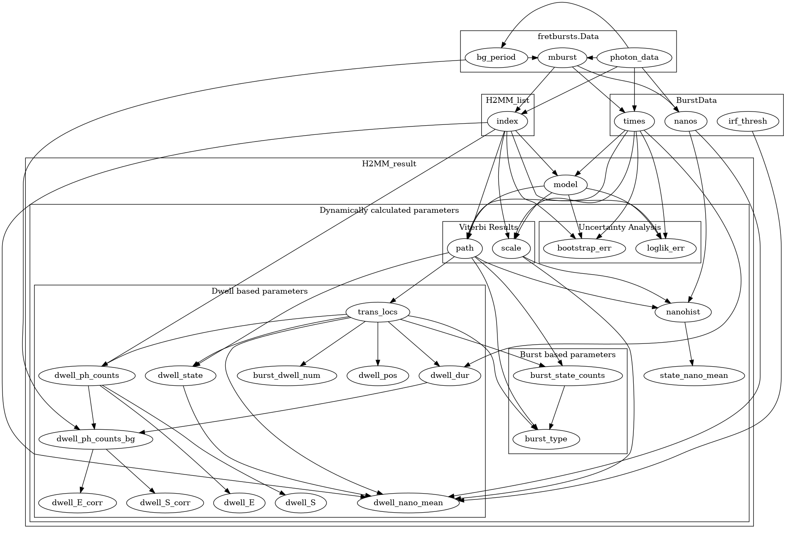

Discussion
==========

.. currentmodule:: burstH2MM

.. _whath2mm:

What is |H2MM|?
---------------

|H2MM| is an extension of hiddenm Markov modeling, a broad set of methods for finding underlying behavior in noisy systems.
The basic assumptions of hidden Markov models are:

#. The system is described by a Markvov model
    a. The data describes a system that transitions between a set of states.
    b. When the system is in a given state, it has a distinct set of probabilities to transition to each of the other states
    c. The system is memoryless, that is the probability to transition to another state is only influenced by the current state, and not any of the previous states
#. The model is hidden, meaning
    a. The states cannot be directly observed, rather
    b. Each state has a certain probability to produce certain observable results, with each state having a different set of probabilities

The earliest applications of HMM were towards language processing, for which it was not very successful, but has found much greater use in signal processing.
HMM has also found extensive use in analyzing TIRF based smFRET trajectories.
All of these applications however, assume that there is a constant data rate, for a camera with a set frame rate so that there is an image every ms.

This is not the case for single molecule confocal based data using single photon detectors.
Here, data comes in sparsely, as individual photons, with varying interphoton times.
|H2MM| extends the HMM algorithm to accept these variable interphoton times, allowing application of the HMM machinery with confocal data without implementing an external time bin.

HMM methods use the Baum-Welch algorithm in an optimization process which finds the model of a set number of states that best describes the data.
Now since the number of states is fixed, other optimizations must be conducted with different numbers of states.
Then the different optimized models must be compared, and the best one chosen, and the ones with too many (overfit) and too few (underfit) states rejected.

A final thing to understand about |H2MM|, is the use of indices.
In |H2MM|, data comes in a set of detector chanels, in the first iterations, these were exclusively the |DD| and |DA| channels, but with mp |H2MM|, this was extended to the |AA| channel, and was even suggested to be able to include the parallel and perpendicular channels in anisotropy based measurements.
A comparison to the original application of HMM methods is apt here: originally HMM was developed to analyze word patterns, so each word was a unique index, and each state had a given probability to produce each word.
So in |H2MM| each photon can be compared to a word, each photon receives a set of a limited number of indices.

A Brief History of |H2MM|
-------------------------

Application to confocal single molecule data started with `Gopich and Szabo 2009 <https://doi.org/10.1021/jp903671p>`_ who established the maximum likelihood estimator to calculated the likelihood of a model of transition rates and emission probabilities for a set of data.
`Pirchi and Tsukanov et. al. 2016 <https://doi.org/10.1021/acs.jpcb.6b10726>`_ then integrated the Baum-Welch algorithm, with some reformulation of Gopich and Szabo's original equations, which allowed for an optimization procedure ensuring that the likelihood of each iteration improves.
This made finding the ideal model a feasible undertaking.
However, discrimination between over and underfit models (models with too many or too few states), `Lerner et. al. 2018 <https://doi.org/10.1063/1.5004606>`_ introduced the first attempt at this, with the modified Bayes Information Criterion, and finally the Integrated Complete Likelihood was introduced in `Harris et. al. 2022 <https://doi.org/10.1038/s41467-022-28632-x>`_, which proved a more reliable statistical discriminator.
`Harris et. al. 2022 <https://doi.org/10.1038/s41467-022-28632-x>`_ also introduced the multiparameter approach, where the |AA| stream was integrated allowing discrimination of photophysical and FRET dynamics.
They also introduced the H2MM_C python package, one which burstH2MM depends, which accelerated the calculations by implementing the core algorithm in C rather than in matlab, performing approximately 100 times faster.

Data organization
-----------------

    Map of data class reference in burstH2MM

In burstH2MM, there data analysis and organization is hierarchical. At the top there is the starting ``fretbursts.Data`` object, where the raw data is stored, and where the bursts are identified.
The next level is the |BurstData| object, which serves 3 key roles:

#. Transition from fretbursts to burstH2MM
#. Select which set of photon streams to use (i.e. single vs multiparameter |H2MM|, excluding or including the |AA| stream)
#. Organize divisor schemes

Stored within the |BurstData|, in the :attr:`BurstData.models <BurstSort.BurstData.models>` attribute, is a |H2MM_list| object.
This is created when the |BurstData| object is created.

The |H2MM_list| object serves primarily to:

#. Organize optimized models (Primary function)
#. Hold divisor schemes (Secondary function)

Underneath the |H2MM_list| object are |H2MM_result| objects, these

#. Hold an optimized model
#. Analyze *Viterbi* paths of optimized model
#. Generate dwell statistics

The |BurstData| object keeps track of all |H2MM_list| objects it creates, and likewise each |H2MM_list| object keeps track of all |H2MM_result| object that it creates.

For |BurstData| there are two places where the child |H2MM_list| objects are kept.
The first is in the :attr:`models <BurstSort.BurstData.models>` attribute, the second is in the :attr:`div_models <BurstSort.BurstData.div_models>` attribute. 
:attr:`models <BurstSort.BurstData.models>` only has one |H2MM_list| associated with it, while :attr:`div_models <BurstSort.BurstData.div_models>` is a dictionary. :attr:`models <BurstSort.BurstData.models>` serves as the main model, which identifies photons only by photon stream (i.e. |DD|, |DA|, or |AA|), and as such serves as the main |H2MM| optimization.
|H2MM_list| objects stored in :attr:`div_models <BurstSort.BurstData.div_models>` use divisor schemes to use photon nanotimes to further distinguish different photon streams.

.. _datacreation:

On demand data creation
***********************

While burstH2MM is generally designed such that the user doesn't have to interact directly with the times, and photon indexes, they are still accessible.
Since the macrotime and nanotimes do not change, these are stored in the |BurstData| object, and |H2MM_list| objects reference their parent to get this data.
However, the indexes, how |H2MM| identifies the photons, depends on the divisor scheme, and thus each |H2MM_list| object must have its own set of indexes.

Since all of these do not change from optimization to optimization, the |H2MM_result| object similarly uses reference to its parents to get this data. It is the state path and posterior probabilities that are unique to each individual optimization, so like the optimized model, these are also stored uniquely for each |H2MM_result|.

The rest of the calculated (mostly dwell based) parameters are similarly unique, and thus stored separately for each |H2MM_result| object.
Here burstH2MM is designed to be smart in how it uses memory.
With large data, each optimization creates a new set of data, which contains several values for each photon.
This can eat up memory, so burstH2MM does not immediately calculate all these parameters once a model is optimized, rather it calculates the necessary arrays when the user requests said data.
Therefore if certain parameters are never used, those arrays aren't calculated. Thus many parameters aren't calculated for non-ideal models.
Because this does take time, once calculated burstH2MM keeps the calculated parameter in memory, so that future access does not require recalculating that parameter.
If memory does become an issue, the method |trim_data| can be called, which clears all *Viterbi* based parameters, leaving only the optimized |H2MM| model still in memory.
If a parameter is needed again, it can be recalculated without having to re-run the optimization.

Below the map of dependencies for each of the dwell parameters.
To know what needs to be calculated for a given parameter, follow the arrows backwards to see which parameters will be calculated in order to access the given parameter.

    Parameters generation tree. Boxes indicate categories, if the name is that of a burstH2MM object, then all parameters within are attributes of said object.

.. _divisor:

Divisors
--------

.. note::
  
    This section is closely related with the how to section :ref:`Customizing Divisors <divlochowto>`.
    It will be useful to read them together.

A more recent development in |H2MM| is the integration of photon nanotimes into |H2MM| analysis.
The basic version of mp |H2MM| assigned photon indices only using the detector and excitation stream.
With divisors, each of these streams an now be broken up into more indices by divisors.

If each nanotime received its own index, there would be too many for |H2MM| to properly analyze, so instead we use divisors to separate each excitation window into several nanotime based indices, many fewer than the raw nanotime bins would, and therefore making the optimization tractable for mp |H2MM|.

|auto_div| uses our even-division strategy to automatically assign what are hopefully sensible divisors.
This however assumes that the underlying states have an at least somewhat equal population, and have a decay that is dominated by one exponential lifetime.
If however you know that your system does not follow this pattern, you may want to consider |new_div| to use what you do know about your system to make a more sensible set of divisors.

.. |H2MM| replace:: H\ :sup:`2`\ MM
.. |DD| replace:: D\ :sub:`ex`\ D\ :sub:`em`
.. |DA| replace:: D\ :sub:`ex`\ A\ :sub:`em`
.. |AA| replace:: A\ :sub:`ex`\ A\ :sub:`em`
.. |BurstData| replace:: :class:`BurstData <BurstSort.BurstData>`
.. |div_models| replace:: :attr:`BurstData.div_models <BurstSort.BurstData.div_models>`
.. |auto_div| replace:: :meth:`BurstData.auto_div() <BurstSort.BurstData.auto_div>`
.. |new_div| replace:: :meth:`BurstData.new_div() <BurstSort.BurstData.new_div>`
.. |irf_thresh| replace:: :attr:`BurstData.irf_thresh <BurstSort.BurstData.irf_thresh>`
.. |H2MM_list| replace:: :class:`H2MM_list <BurstSort.H2MM_list>`
.. |divisor_scheme| replace:: :attr:`H2MM_list.divisor_scheme <BurstSort.H2MM_list.divisor_scheme>`
.. |list_bic| replace:: :attr:`H2MM_list.BIC <BurstSort.H2MM_list.BIC>`
.. |list_bicp| replace:: :attr:`H2MM_list.BICp <BurstSort.H2MM_list.BICp>`
.. |list_icl| replace:: :attr:`H2MM_list.ICL <BurstSort.H2MM_list.ICL>`
.. |calc_models| replace:: :meth:`H2MM_list <BurstSort.H2MM_list.calc_models>`
.. |opts| replace:: :attr:`H2MM_list.opts <BurstSort.H2MM_list.opts>`
.. |H2MM_result| replace:: :class:`H2MM_result <BurstSort.H2MM_result>`
.. |trim_data| replace:: :meth:`H2MM_result.trim_data() <BurstSort.H2MM_result.trim_data>`
.. |model_E| replace:: :attr:`H2MM_result.E <BurstSort.H2MM_result.E>`
.. |model_E_corr| replace:: :attr:`H2MM_result.E_corr <BurstSort.H2MM_result.E_corr>`
.. |model_S| replace:: :attr:`H2MM_result.S <BurstSort.H2MM_result.S>`
.. |model_S_corr| replace:: :attr:`H2MM_result.S_corr <BurstSort.H2MM_result.S_corr>`
.. |model_trans| replace:: :attr:`H2MM_result.trans <BurstSort.H2MM_result.trans>`
.. |nanohist| replace:: :attr:`H2MM_result.nanohist <BurstSort.H2MM_result.nanohist>`
.. |dwell_pos| replace:: :attr:`H2MM_result.dwell_pos <BurstSort.H2MM_result.dwell_pos>`
.. |dwell_dur| replace:: :attr:`H2MM_result.dwell_dur <BurstSort.H2MM_result.dwell_dur>`
.. |dwell_state| replace:: :attr:`H2MM_result.dwell_state <BurstSort.H2MM_result.dwell_state>`
.. |dwell_ph_counts| replace:: :attr:`H2MM_result.dwell_ph_counts <BurstSort.H2MM_result.dwell_ph_counts>`
.. |dwell_ph_counts_bg| replace:: :attr:`H2MM_result.dwell_ph_counts_bg <BurstSort.H2MM_result.dwell_ph_counts_bg>`
.. |dwell_E| replace:: :attr:`H2MM_result.dwell_E <BurstSort.H2MM_result.dwell_E>`
.. |dwell_E_corr| replace:: :attr:`H2MM_result.dwell_E_corr <BurstSort.H2MM_result.dwell_E_corr>`
.. |dwell_S| replace:: :attr:`H2MM_result.dwell_S <BurstSort.H2MM_result.dwell_S>`
.. |dwell_S_corr| replace:: :attr:`H2MM_result.dwell_S_corr <BurstSort.H2MM_result.dwell_S_corr>`
.. |burst_dwell_num| replace:: :attr:`H2MM_result.burst_dwell_num <BurstSort.H2MM_result.burst_dwell_num>`
.. |dwell_nano_mean| replace:: :attr:`H2MM_result.dwell_nano_mean <BurstSort.H2MM_result.dwell_nano_mean>`
.. |trans_locs| replace:: :attr:`H2MM_result.trans_locs <BurstSort.H2MM_result.trans_locs>`
.. |result_bic| replace:: :attr:`H2MM_result.bic <BurstSort.H2MM_result.bic>`
.. |result_bicp| replace:: :attr:`H2MM_result.bicp <BurstSort.H2MM_result.bicp>`
.. |result_icl| replace:: :attr:`H2MM_result.icl <BurstSort.H2MM_result.icl>`
.. |dwell_ES_scatter| replace:: :func:`dwell_ES_scatter() <Plotting.dwell_ES_scatter>`
.. |dwell_tau_hist| replace:: :func:`dwell_tau_hist() <Plotting.dwell_tau_hist>`
.. |dwell_E_hist| replace:: :func:`dwell_E_hist() <Plotting.dwell_E_hist>`
.. |raw_nanotime_hist| replace:: :func:`raw_nanotime_hist <Plotting.raw_nanotime_hist>`
