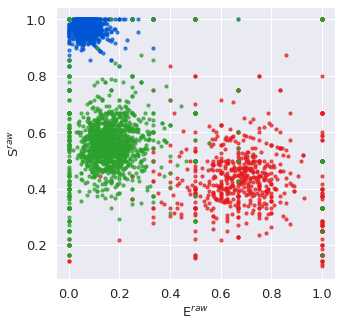

Simulations
===========

.. currentmodule:: burstH2MM

.. note::

    Download the file used in the analysis here: `HP3_TE300_SPC630.hdf5 <https://zenodo.org/record/5902313/files/HP3_TE300_SPC630.hdf5>`_
    For this tutorial, we will assume the following code has been executed prior to all given code snippets (this come from the :ref:`tutorial <tuthidden>`)::

        # import statements
        import numpy as np
        from matplotlib import pyplot as plt
        import fretbursts as frb
        import burstH2MM as hmm
        sns = frb.init_notebook()
        # path to your file
        filename = 'your_file.hdf5'
        # load data into fretbursts
        # load the data into the data object frbdata
        frbdata = frb.loader.photon_hdf5(filename)
        frb.loader.alex_apply_period(frbdata)
        # calculate background counts
        frbdata.calc_bg(frb.bg.exp_fit, F_bg=1.7)
        # now perform burst search
        frbdata.burst_search(m=10, F=6)
        # make sure to set the appropriate thresholds of ALL size
        # parameters to the particulars of your experiment
        frbdata_sel = frbdata.select_bursts(frb.select_bursts.size, th1=50)
        # now make the BurstData object
        bdata = hmm.BurstData(frbdata_sel)
        bdata.models.calc_models()
        # set irf_thresh since later in tutorial we will discuss nanotimes
        bdata.irf_thresh = np.array([2355, 2305, 220])

After an optimization has been conducted, several models are generated and compared.
While statistical discriminators like the **ICL** and **BIC** are perhaps the most useful, another method to "check" the reasonableness of a model is to run a Monte-Carlo simulations.
Using the probabilities derived from the model, and a set of arrival times, the :func:`Simulations.simulate` generates a set of photon indices (streams).

::

   sdata = hmm.sim.simulate(bdata.models[2])

The result is a special |Sim_Result| object, which mimics a |H2MM_result| object, but uses the simulated times and stores the actual simulated path instead of the *Viterbi* path in the path variable.

Thus, you can interogate its parameters just like |H2MM_result| for instance::

>>> sdata.dwell_E

array([0.29166667, 0.04      , 0.21917808, ..., 0.01724138, 0.17073171, 0.03571429])

And it even functions in the plotting functions::

    fig, ax = plt.subplots(figsize=(5,5))
    hmm.dwell_ES_scatter(sdata, ax=ax)

.. note::

    The simulation does not simulate the photon nanotimes.
    While divisors are simulated, the individual nanotimes are not, and thus trying to access any nanotime-derived parameter in a |Sim_Result| object will result in an error.

.. |H2MM| replace:: H\ :sup:`2`\ MM
.. |BurstData| replace:: :class:`BurstData <BurstSort.BurstData>`
.. |H2MM_list| replace:: :class:`H2MM_list <BurstSort.H2MM_list>`
.. |H2MM_result| replace:: :class:`H2MM_result <BurstSort.H2MM_result>`
.. |Sim_Result| replace:: :class:`sim.Sim_Result <Simulations.Sim_Result>`

