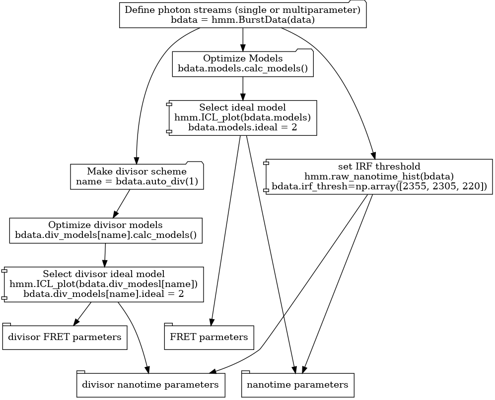
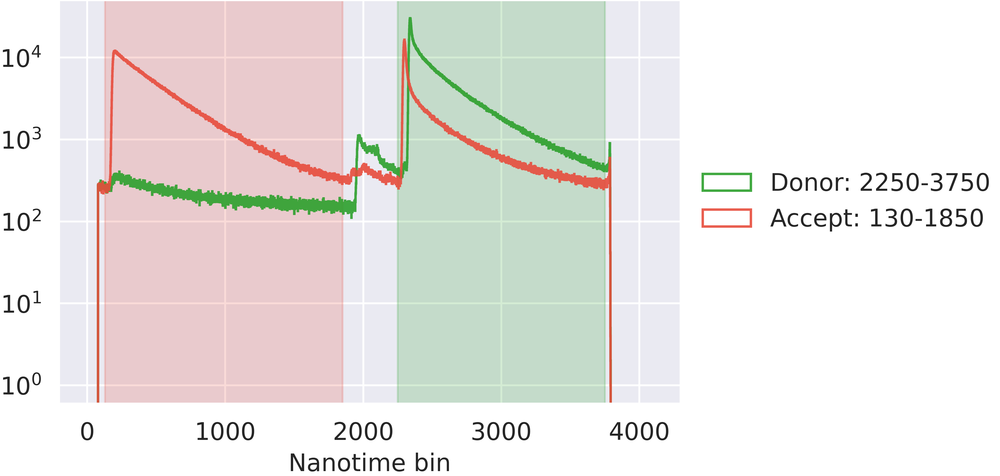
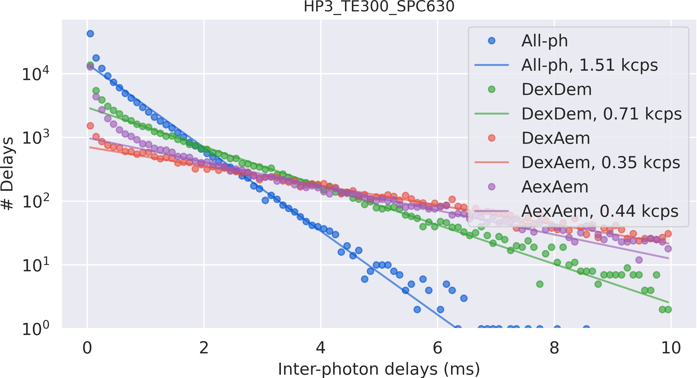
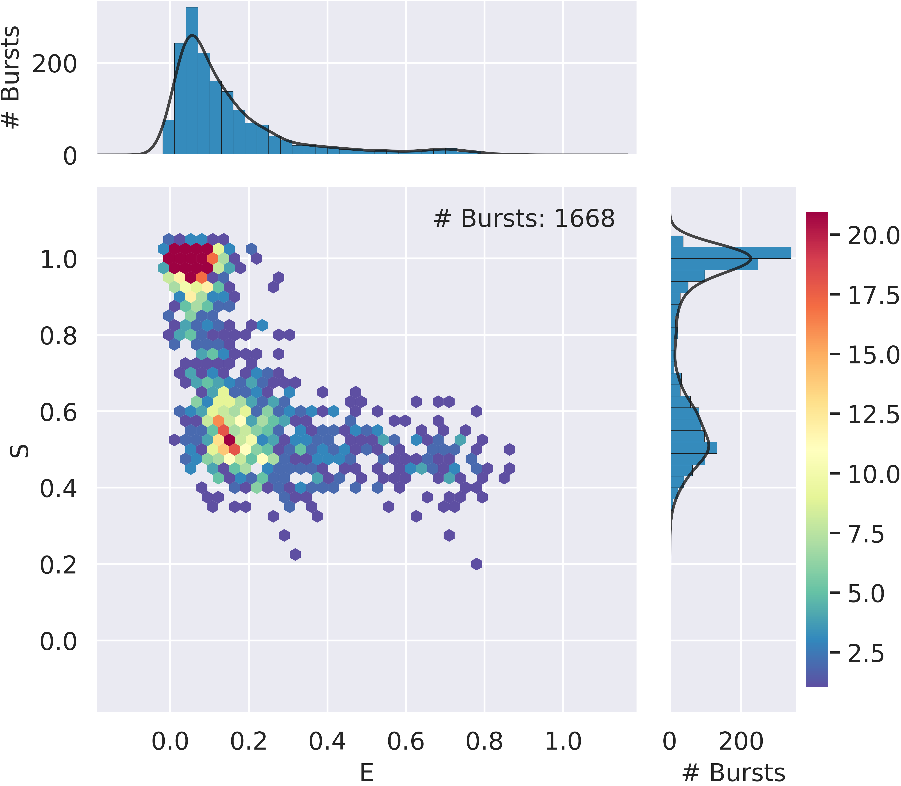
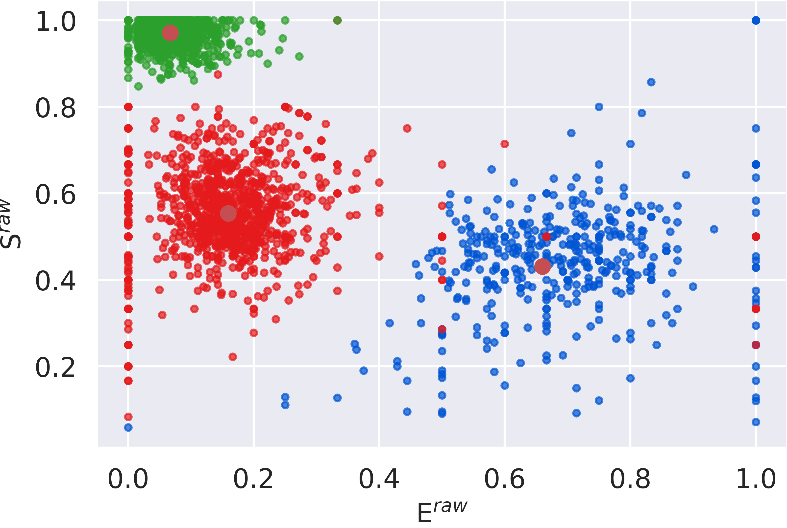
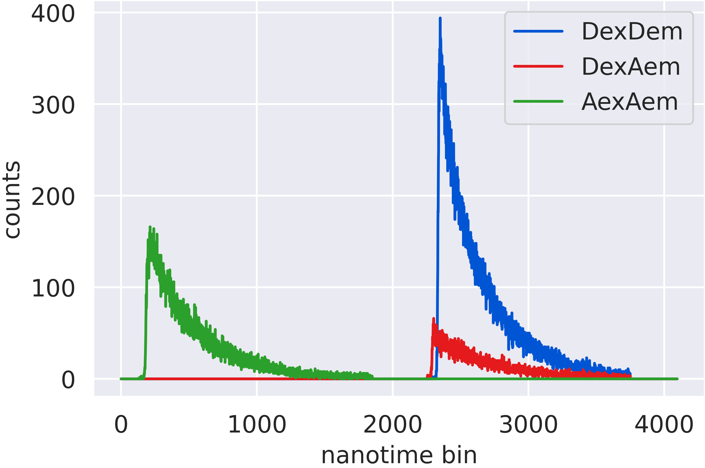
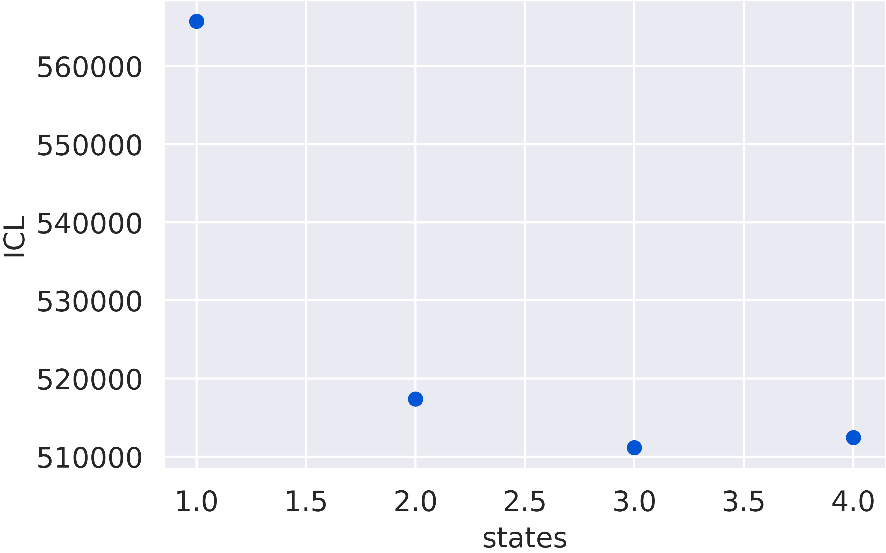
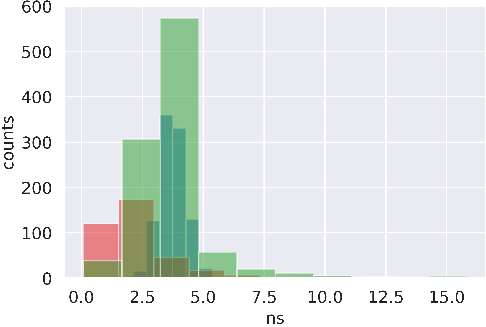

Tutorials
=========

.. currentmodule:: burstH2MM

.. contents::

.. seealso::

    View this tutorial as a jupyter notebook
    Download :download:`Tutorial.ipynb <notebooks/Tutorial.ipynb>`

.. _tuthidden:

Finding Hidden States
---------------------

.. note::
    FRETBursts and burstH2MM were both built with Jupyter Notebooks in mind.
    As such, using the jupyter notebook tutorials will likely be more applicable.
    Jupyter Notebooks allow for inline display of figures, useful for checking the quality of data at each step, and for explaining your data analysis.

To start the analysis of burst data with |H2MM|, we first need to process the data with FRETBursts, one of the dependencies of burstH2MM.

.. note::

    The file used in this tutorial can be downloaded here: `HP3_TE300_SPC630.hdf5 <https://zenodo.org/record/5902313/files/HP3_TE300_SPC630.hdf5>`_

So let's load the data and search for bursts::

    import numpy as np
    from matplotlib import pyplot as plt

    import fretbursts as frb
    import burstH2MM as bhm

    sns = frb.init_notebook()

    filename = 'your_file.hdf5'
    # load the data into the data object frbdata
    frbdata = frb.loader.photon_hdf5(filename)

Now it is best to check the alternation period etc.::

    # plot the alternation histogram
    frb.bpl.plot_alternation_hist(frbdata)

If the alternation period looks good, we can apply the alternation period to assign Donor/Acceptor excitation to each photon::

    # if the alternation period is correct, apply data
    frb.loader.alex_apply_period(frbdata)

Then calculate the background rates used to set thresholds for finding bursts::

    # calcualte the background rate
    frbdata.calc_bg(frb.bg.exp_fit, F_bg=1.7)
    # plot bg parameters, to verify quality
    frb.dplot(frbdata, frb.hist_bg)

And finally search for bursts and refine the selection by appropriate burst size/width/other parameters::

    # now perform burst search
    frbdata.burst_search(m=10, F=6)
    # make sure to set the appropriate thresholds of ALL size
    # parameters to the particulars of your experiment
    frbdata_sel = frbdata.select_bursts(frb.select_bursts.size, th1=50)

    frb.alex_jointplot(frbdata_sel);

Now that the data is selected, we can segment the photons into bursts, which will be stored in a |BurstData| object::

    bdata = bhm.BurstData(frbdata_sel)

``bdata`` is now the object that will organize the downstream information for optimization.
When ``bdata`` was created, it automatically also generated a |H2MM_list| object, stored in |models| which is where we can perform the |H2MM| optimizations.

.. _tutops:

So let's run a round of optimizations::

    # calculate models
    bdata.models.calc_models()

When you run this, it will optimize |H2MM| models over a range of states. The next task is to select the ideal number of states. To select this, there are several options, but for now we will use the Integrated Complete Likelihood (ICL). The model with the minimal ICL is *usually* the best model::

    bhm.ICL_plot(bdata.models)

.. image:: images/iclplot.png

Now that the ideal model has been identified, we can plot the E/S values of each dwell with |dwell_ES_scatter|, which colored by state.
We can also overlay the E/S values derived from the |H2MM| model over the dwell values. Note that we pass the ``s=50, c="r"`` arguments to the |scatter_ES| function, which ensure the size of the points is appropriate, as well as making the color pop ::

    # plot the dwell ES of the result
    bhm.dwell_ES_scatter(bdata.models[2])
    # overlay with the main values,
    bhm.scatter_ES(bdata.models[2], s=50, c="r")
    # plot transition rate arrows
    bhm.trans_arrow_ES(bdta.models[2])

.. seealso::

    There are many more plotting functions. 
    You can review these in the |Plotting|  module.

    Additionally, see the how to guide |ControlPlot|

We can examine the model E and S values with the :attr:`H2MM_result.E` and :attr:`H2MM_result.S` as numpy arrays:

>>> bdata.models[2].E, bdata.models[2].S
(array([0.66031035, 0.15955158, 0.06730048]),
 array([0.43073408, 0.55348988, 0.9708039 ]))
>>> bdata.models[2].trans
array([[1.99994147e+07, 5.31727534e+02, 5.35446778e+01],
       [2.05278876e+02, 1.99996914e+07, 1.03279433e+02],
       [7.90892082e+00, 1.16271415e+02, 1.99998758e+07]])

burstH2MM attempts to calculate the most common dwell parameters, and to allow for intelligent selection of different sorts of dwells/bursts and do most of the heavy lifting for the user. These are nearly all stored as attributes in |H2MM_result| objects.
See the dwell selection discussion section to see how some of these aspects work.

Using the Divisor Approach
--------------------------

burstH2MM also allows the |H2MM| input data to incorporate photon nanotimes using the divisor approach.
Before using divisors, and therefore nanotimes, it is best to analyze the lifetime decays, and set appropriate thresholds for the IRF of each stream, so we will first plot the decays

.. note::

    Notice that we are applying these nanotime settings to `bdata`, the original |BurstData| object created at the beginning of the tutorial.
    This is because these are universal settings for all |H2MM_list| objects created from their parent |BurstData| object.
    As such, these settings are "remembered" through all children of `bdata`

::

    bhm.raw_nanotime_hist(bdata)

Now we can choose the best thresholds for the IRF, and we will set the |irf_thresh| attribute.

.. note::

    The order of thresholds corresponds to the order of streams in |ph_streams| is the order of threshold in |irf_thresh|

::

    bdata.irf_thresh = np.array([2355, 2305, 220])

Now that the IRF thresholds have been set, we should have no problems down the road when calculating dwell mean nanotimes and other such parameters.

We are now ready to actually start using the divisor approach.
First a new divisor must be set::

    div_name = bdata.auto_div(1)

This creates a new divisor based |H2MM_list| object stored in the dictionary |div_models| with the key returned by the function (stored in ``div_name``).
So let's extract the |H2MM_list| object generated, and then run an optimization::

    # run H2MM analysis
    bdata.div_models[div_name].calc_models()

Next, as before, we need to look at the ICL, to choose the ideal model ::

    bhm.ICL_plot(bdata.div_models[div_name])

The 3 state model again looks like the best fit, so we will reference it with index 2 (remember python indexes from 0).
Now we can finally plot the distribution of nanotimes per state.
For this there is the |dwell_tau_hist| ::

    bhm.dwell_tau_hist(bdata.div_models[div_name][2])

Continue with the :ref:`howto` section for more explanations of how to use these functions in more detail, and how to refine and filter dwells by various methods.

.. |H2MM| replace:: H\ :sup:`2`\ MM
.. |BurstData| replace:: :class:`BurstData <BurstSort.BurstData>`
.. |H2MM_list| replace:: :class:`H2MM_list <BurstSort.H2MM_list>`
.. |H2MM_result| replace:: :class:`H2MM_result <BurstSort.H2MM_result>`
.. |models| replace:: :attr:`BurstData.models <BurstSort.BurstData.models>`
.. |div_models| replace:: :attr:`BurstData.div_models <BurstSort.BurstData.div_models>`
.. |irf_thresh| replace:: :attr:`BurstData.irf_thresh <BurstSort.BurstData.irf_thresh>`
.. |ph_streams| replace:: :attr:`BurstData.ph_strearms <BurstSort.BurstData.ph_streams>`
.. |dwell_tau_hist| replace:: :func:`dwell_tau_hist() <Plotting.dwell_tau_hist>`
.. |dwell_ES_scatter| replace:: :func:`dwell_ES_scatter() <Plotting.dwell_ES_scatter>`
.. |scatter_ES| replace:: :func:`scatter_ES() <Plotting.scatter_ES>` 
.. |Plotting| replace:: :mod:`Plotting <Plotting>`
.. |ControlPlot| replace:: :ref:`Control Plotting Functions <controlplot>`
