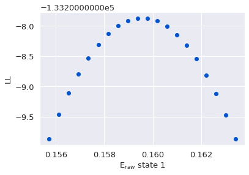
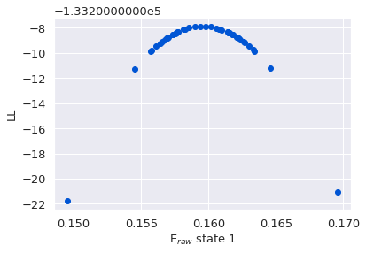
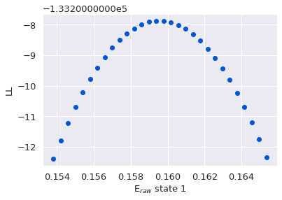
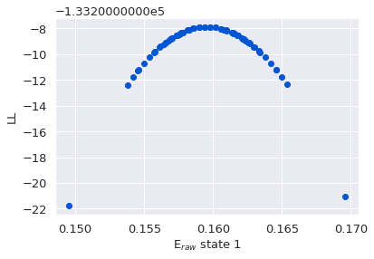
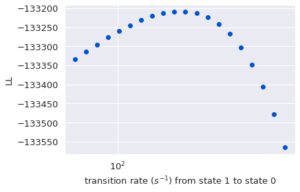
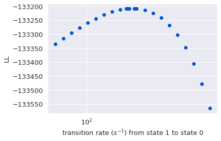
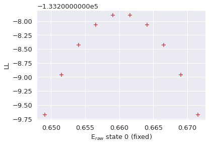
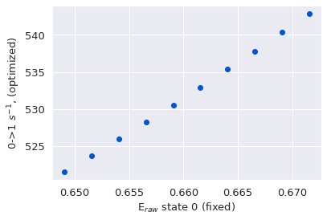
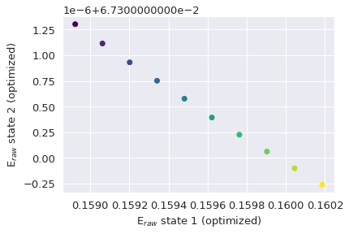
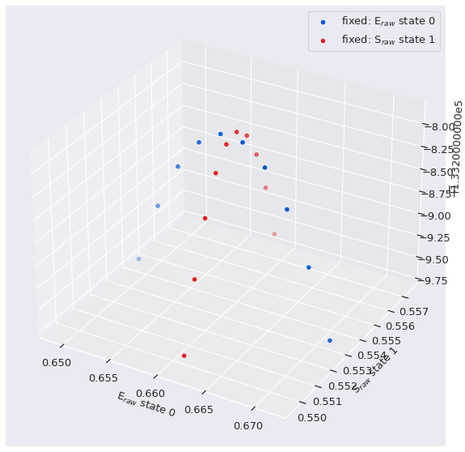

.. currentmodule:: burstH2MM

Quantifying Accuracy/Precision of Model Parameter Values
========================================================

.. note::

    Download the file used in the analysis here: `HP3_TE300_SPC630.hdf5 <https://zenodo.org/record/5902313/files/HP3_TE300_SPC630.hdf5>`_
    For this tutorial, we will assume the following code has been executed prior to all given code snippets (this come from the :ref:`tutorial <tuthidden>`)

    .. code:: python3

        # import statements
        import numpy as np
        from matplotlib import pyplot as plt
        import fretbursts as frb
        import burstH2MM as bhm
        sns = frb.init_notebook()
        # path to your file
        filename = 'your_file.hdf5'
        # load data into fretbursts
        # load the data into the data object frbdata
        frbdata = frb.loader.photon_hdf5(filename)
        frb.loader.alex_apply_period(frbdata)
        # calculate background counts
        frbdata.calc_bg(frb.bg.exp_fit, F_bg=1.7)
        # now perform burst search
        frbdata.burst_search(m=10, F=6)
        # make sure to set the appropriate thresholds of ALL size
        # parameters to the particulars of your experiment
        frbdata_sel = frbdata.select_bursts(frb.select_bursts.size, th1=50)
        # now make the BurstData object
        bdata = bhm.BurstData(frbdata_sel)
        bdata.models.calc_models()

Bootstrap method
----------------

Perhaps the easiest to understand method for quantifying uncertainty in a model is the bootstrap method. In this method, the bursts are split up into :math:`N` subsets, and separate optimizations are run on each subset.
Then the variance of each parameter value across the :math:`N` different subsets serves as a quantification of the uncertainty.

In burstH2MM, the |H2MM_result| object has the |HMLbsev| method which performs this operation.

|HMLbsev| has one keyword argument: ``subsets`` by which you can specify the number of subsets to divide the data into.
The default is 10, which is usually a good compromise.

>>> bdata.models[2].bootstrap_eval(subsets=5)
The model converged after 281 iterations
The model converged after 216 iterations
The model converged after 2037 iterations
The model converged after 228 iterations
The model converged after 263 iterations
(array([[89.31500655, 60.39334636, 51.39788334],
        [32.52744442, 36.89793183, 24.65781737],
        [ 8.20598513, 16.43883212, 12.39365941]]),
 array([0.0255139 , 0.00435776, 0.00127755]),
 array([0.00960336, 0.00264026, 0.00212474]))

Note how the number of subsets is the number of optimizations.
This method automatically stores the results in the |HMLbserr| attribute, and the transition rate, E, and S values are also supplied as return values.

Once you run bootstrap_eval, you can now access |trans_std_bs|, |E_std_bs|, |S_std_bs| attributes of |H2MM_result|, which are the standard deviations of each parameter of the optimized models of the subsets.

>>> bdata.models[2].trans_std_bs
array([[89.31500655, 60.39334636, 51.39788334],
       [32.52744442, 36.89793183, 24.65781737],
       [ 8.20598513, 16.43883212, 12.39365941]])

>>> bdata.models[2].E_std_bs, bdata.models[2].S_std_bs
(array([0.0255139 , 0.00435776, 0.00127755]),
 array([0.00960336, 0.00264026, 0.00212474]))

Closer examination of models
~~~~~~~~~~~~~~~~~~~~~~~~~~~~

|HMLbserr| attribute allows closer examination of these subsets.
This attribute is an instance of the class |BS_Error|, which is made to coordinate the bootstrap evaluation.
The |H2MM_result| attributes |trans_std_bs|, |E_std_bs|, |S_std_bs| are just aliases of the attributes of |BStrans_std|, |BSE_std|, and |BSS_std| in its |HMLbserr| attribute.

>>> bdata.models[2].bootstrap_err.trans_std
array([[89.31500655, 60.39334636, 51.39788334],
       [32.52744442, 36.89793183, 24.65781737],
       [ 8.20598513, 16.43883212, 12.39365941]])
>>> bdata.models[2].bootstrap_err.E_std, bdata.models[2].bootstrap_err.S_std
(array([0.0255139 , 0.00435776, 0.00127755]),
 array([0.00960336, 0.00264026, 0.00212474]))

For E and S, the leakage/direct excitation/:math:`\gamma` and :math:`\beta` correct values: |BSE_std_corr| and |BSS_std_corr|

>>> bdata.models[2].bootstrap_err.E_std_corr, bdata.models[2].bootstrap_err.S_std_corr
(array([0.0255139 , 0.00435776, 0.00127755]),
 array([0.00960336, 0.00264026, 0.00212474]))

If on the other hand, you would prefer to take the standard error, instead of standard deviation of the subsets, there are equivalent attributes |BStrans_err|, |BSE_err|, and |BSS_err|.

>>> bdata.models[2].bootstrap_err.trans_err
array([[39.94288521, 27.00872557, 22.98583221],
       [14.54671537, 16.50125676, 11.02731116],
       [ 3.66982811,  7.35166922,  5.54261299]])
>>> bdata.models[2].bootstrap_err.E_err, bdata.models[2].bootstrap_err.S_err
(array([0.01141016, 0.00194885, 0.00057134]),
 array([0.00429476, 0.00118076, 0.00095021]))

For E and S, the leakage/direct excitation/:math:`\gamma` and :math:`\beta` correct values: |BSE_err_corr|,
and |BSS_err_corr|,

>>> bdata.models[2].bootstrap_err.E_err_corr, bdata.models[2].bootstrap_err.S_err_corr
(array([0.01141016, 0.00194885, 0.00057134]),
  array([0.00429476, 0.00118076, 0.00095021]))

You can also see the values of the individual subset models. This is done through the attribute |BS_models|.

This attribute is again another special class, |ModSet| used for organizing models that vary only in their specific parameter values, but share the same number of states, and data and divisor scheme.
It lets you access the transition rate, E and S values as attributes, and for E and S, access these with the |ModSet_trans|, |ModSet_E|, |ModSet_S| attributes respectively.
For E and S, the leakage/direct excitation/:math:`\gamma` and :math:`\beta` correct values are accessible with the |ModSet_Ecorr| and |ModSet_Scorr| attributes.

The organization of these arrays is ``[state, subset]`` for E and S, and
``[from_state, to_state, subset]`` for transition rates.

>>> bdata.models[2].bootstrap_err.models.trans
array([[[1.99993025e+07, 5.47412479e+02, 1.50107233e+02],
        [2.56911279e+02, 1.99996697e+07, 7.33962982e+01],
        [2.71843192e+01, 9.25544845e+01, 1.99998803e+07]],
       [[1.99994454e+07, 5.01289443e+02, 5.33489401e+01],
        [2.02533253e+02, 1.99996915e+07, 1.06001372e+02],
        [7.16694576e+00, 1.38306709e+02, 1.99998545e+07]],
       [[1.99994312e+07, 5.68807994e+02, 1.95076975e-05],
        [2.15768390e+02, 1.99996411e+07, 1.43089272e+02],
        [4.79837332e+00, 1.25242149e+02, 1.99998700e+07]],
       [[1.99995343e+07, 4.36097836e+02, 2.95649735e+01],
        [1.55146876e+02, 1.99997508e+07, 9.40438301e+01],
        [7.29036042e+00, 1.10009130e+02, 1.99998827e+07]],
       [[1.99993033e+07, 6.12696933e+02, 8.40198390e+01],
        [2.11897886e+02, 1.99997083e+07, 7.98319301e+01],
        [8.19436183e+00, 1.01374640e+02, 1.99998904e+07]]])
>>> bdata.models[2].bootstrap_err.models.E, bdata.models[2].bootstrap_err.models.S
(array([[0.63874835, 0.16143699, 0.06563951],
        [0.66284054, 0.15296922, 0.06698833],
        [0.67054299, 0.15811327, 0.06875795],
        [0.62598317, 0.16620046, 0.06867949],
        [0.69909413, 0.15815619, 0.06616314]]),
 array([[0.43073863, 0.55001657, 0.97045621],
        [0.43598782, 0.55806883, 0.97225222],
        [0.43725447, 0.55429823, 0.9687245 ],
        [0.43685134, 0.55273276, 0.96839454],
        [0.4119258 , 0.55269972, 0.97400269]]))
>>> bdata.models[2].bootstrap_err.models.E_corr, bdata.models[2].bootstrap_err.models.S_corr
(array([[0.63874835, 0.16143699, 0.06563951],
        [0.66284054, 0.15296922, 0.06698833],
        [0.67054299, 0.15811327, 0.06875795],
        [0.62598317, 0.16620046, 0.06867949],
        [0.69909413, 0.15815619, 0.06616314]]),
 array([[0.43073863, 0.55001657, 0.97045621],
        [0.43598782, 0.55806883, 0.97225222],
        [0.43725447, 0.55429823, 0.9687245 ],
        [0.43685134, 0.55273276, 0.96839454],
        [0.4119258 , 0.55269972, 0.97400269]]))

Loglikelihood Uncertainty Evaluation
------------------------------------

The bootstrap error is very simple, however, it also can take a long
time, and the particular subsets used may have a significant influence
on the calculated values.

What is loglikelihood uncertainty?
~~~~~~~~~~~~~~~~~~~~~~~~~~~~~~~~~~

The assessment of the loglikelihood uncertainties relies on finding the loglikelihood of models where one of the model parameter values has been offset from the optimal value.
While a full statistical analysis would require integration across the whole parameter space, we note that the loglikelihoods generally distribute in a Gaussian-like manner.
Therefore we can approximate the uncertainty by finding the point at which the loglikelihood is some amount less than the optimal model:

.. math::
    
    LL(\lambda _{\Delta E_{n}}) = LL(\lambda _{optimal}) - 0.5

There are two points at which this is true.
One where :math:`E_{n}` is greater than the optimal :math:`E_{n}`, and another, where :math:`E_{n}` is less than the optimal :math:`E_{n}`, denoted :math:`E_{n, high}` and :math:`E_{n, low}` respectively.

The errors reported are thus:

:math:`err_{LL}(E) = \frac{E_{n,high} - E_{n,low}}{2}`

Note that in most cases,
:math:`E_{n, high} - E_{n, optimal} \approx E_{n, optimal} - E_{n, low}`

This is not true however, for transition rates, and thus, in lieu of reporting an average value to represent a +/- type of error, instead we report directly the high and low transition rates.

Calculating loglikelihood uncertainty
~~~~~~~~~~~~~~~~~~~~~~~~~~~~~~~~~~~~~

Estimation of Loglikelihood uncertainty is handled by |LLError| objects, which are created automatically when a |H2MM_result| object is created, and stored in the |HML_llerr| attribute.
Upon its creation, no values are actually calculated, only the skeleton exists.

All parameter times (E/S/transition rates) follow the same basic rules, so we will start by demonstrating uncertainty estimation for E.

To estimate the uncertainty for E, we use the
|LLError_getEerr| method.

>>> E_err = bdata.models[2].loglik_err.get_E_err(0)
>>> E_err
0.005624999999999991

The equivalent for the stoichiometry is |LLError_getSerr|:

>>> S_err = bdata.models[2].loglik_err.get_S_err(2)
>>> S_err
0.00077636718749996

These value indicate the point at which models where a given parameter value is varied from the optimal, have a loglikelihood 0.5 less than the optimal model, ie:

.. math::

    LL(\lambda _{\Delta E_{n}}) = LL(\lambda _{optimal}) - 0.5

There are two points at which this is true, one where :math:`E_{n}` is greater than the optimal :math:`E_{n}`, and another, where :math:`E_{n}` is less than the optimal :math:`E_{n}`, denoted :math:`E_{n, high}` and
:math:`E_{n, low}` respectively.

The errors reported are thus:

:math:`err_{LL}(E) = \frac{E_{n,high} - E_{n,low}}{2}`

Note that in most cases,
:math:`E_{n, high} - E_{n, optimal} \approx E_{n, optimal} - E_{n, low}`

This is not true however, for transition rates, and thus, in lieu of reporting an average value to represent a +/- type of error, instead we report directly the high and low transition rates.

>>> trans_err = bdata.models[2].loglik_err.get_trans_err(0,1)
>>> trans_err
masked_array(data=[501.85871794050286, 562.3570683565124],
             mask=[False, False],
       fill_value=inf)

The |LLError_getEerr|/|LLError_getSerr| methods also allow passing the keyword parameter ``simple`` as ``simple=False`` to return the low/high values like |LLError_gettranserr|

>>> E_err = bdata.models[2].loglik_err.get_E_err(0, simple=False)
>>> E_err
masked_array(data=[0.6546853511498953, 0.6659353511498953],
             mask=[False, False],
       fill_value=nan)

>>> S_err = bdata.models[2].loglik_err.get_S_err(0, simple=False)
>>> S_err
masked_array(data=[0.42733563868546065, 0.43415204493546067],
             mask=[False, False],
       fill_value=nan)

Accessing Values Previously Calculated
--------------------------------------

Calculations of the uncertainty values are stored in masked arrays, so
that only calculated values are available. These can be accessed through
the attributes |LLError_E|
|LLError_E|, |LLError_trans|.

>>> bdata.models[2].loglik_err.trans
masked_array(
  data=[[[--, --],
         [501.85871794050286, 562.3570683565124],
         [--, --]], 
        [[--, --],
         [--, --],
         [--, --]], 
        [[--, --],
         [--, --],
         [--, --]]],
  mask=[[[ True,  True],
         [False, False],
         [ True,  True]], 
        [[ True,  True],
         [ True,  True],
         [ True,  True]], 
        [[ True,  True],
         [ True,  True],
         [ True,  True]]],
  fill_value=inf)

>>> bdata.models[2].loglik_err.E
masked_array(data=[0.005624999999999991, --, --],
             mask=[False,  True,  True],
       fill_value=nan)

>>> bdata.models[2].loglik_err.S
masked_array(data=[0.003408203125000009, --, 0.00077636718749996],
             mask=[False,  True, False],
       fill_value=nan)

The |LLError_E| and |LLError_S| are a little more processed than the |LLError_trans|, as these do not show the low/high directly for a given state, but rather show half the difference between them.

If you want to see the actual low and high values, these can be accessed with the |LLError_Elh| and
|LLError_Slh| attributes (this is basically the same as passing the ``simple=False`` keyword argument to |LLError_getEerr|/|LLError_getSerr|:

>>> bdata.models[2].loglik_err.E_lh
masked_array(
  data=[[0.6546853511498953, 0.6659353511498953],
        [--, --],
        [--, --]],
  mask=[[False, False],
        [ True,  True],
        [ True,  True]],
  fill_value=nan)

>>> bdata.models[2].loglik_err.S_lh
masked_array(
  data=[[0.42733563868546065, 0.43415204493546067],
        [--, --],
        [0.9700226555708724, 0.9715753899458723]],
  mask=[[False, False],
        [ True,  True],
        [False, False]],
  fill_value=nan)

Concluding this list of access attributes, the loglikelihood values of these models are also stored in the |LLError_Ell|,
|LLError_Sll|, and |LLError_transll| attributes:

>>> bdata.models[2].loglik_err.E_ll
masked_array(
  data=[[-133208.37002102, -133208.37125570455],
        [--, --],
        [--, --]],
  mask=[[False, False],
        [ True,  True],
        [ True,  True]],
  fill_value=-inf)

>>> bdata.models[2].loglik_err.S_ll
masked_array(
  data=[[-133208.3651500306, -133208.3680673275],
        [--, --],
        [-133208.36725705973, -133208.3685186858]],
  mask=[[False, False],
        [ True,  True],
        [False, False]],
  fill_value=-inf)

Adjusting thresholds
~~~~~~~~~~~~~~~~~~~~

From the earlier equation, the estimated error is defined by having a loglikelihood :math:`0.5` less than the optimal, however, if you wish to change this threshold, to say :math:`1.0`, this can be done (before running any ``get_`` method) by setting the |LLError_thresh| attribute:

>>> bdata.models[2].loglik_err.thresh = 1.0
>>> S_err = bdata.models[2].loglik_err.get_S_err(1)
>>> S_err
0.00277343749999992

Another factor that can be adjusted is how precisely the search algorithm needs to find the loglikelihood, this factor is stored in the |LLError_flex| attribute. The default is :math:`0.005`

>>> bdata.models[2].loglik_err.flex = 5e-2
>>> E_err = bdata.models[2].loglik_err.get_E_err(1)
>>> E_err
0.002695312500000005

These set univeral threshold/flex values, is generally preferred, these values can be altered for each calculation.
This works by passing ``thresh`` and ``flex`` keyword arguments to the
|LLError_getEerr|/|LLError_getSerr|/|LLError_gettranserr|.

.. warning::

   Passing ``thresh`` and ``flex`` keyword arguments to the |LLError_getEerr|/|LLError_getSerr|/|LLError_gettranserr| will only affect the current calculation.
   Therefore all other calculations will have different ``thresh`` and ``flex`` values, and therefore will not be comparable to one another.
   This is why it is discouraged to use this method.

>>> E_err = bdata.models[3].loglik_err.get_E_err(2, thresh=0.1, flex=1e-2)
>>> E_err
0.0010156249999999922

Clearing Values
~~~~~~~~~~~~~~~

Since values already stored are not recalculated, if a new threshold is set, previous values can be cleared using the
|LLError_clearE|, |LLError_clearS|, |LLError_cleartrans|, and |LLError_clearall| methods.
These reset their respective arrays:

.. code:: ipython3

    bdata.models[2].loglik_err.clear_E()
    bdata.models[2].loglik_err.clear_S()
    bdata.models[2].loglik_err.clear_trans()

As the name suggests, |LLError_clearall| clears all the values. So the three lines above, together do what is done bellow in a single line:

.. code:: ipython3

    bdata.models[2].loglik_err.clear_all()

Calculating All Uncertainty Values
----------------------------------

When a given |H2MM_result| has only a few states, it will not take long to characterize the uncertainty of all model parameters, but for 5+ states, this becomes time consuming.
Hence the choice to break with burstH2MM’s normal strategy of calculating on demand and storing the result, and instead using a |LLError_getEerr|/|LLError_getSerr|/|LLError_gettranserr| strategy, and masked arrays, that unmask values that have been calculated.

However, if you so desire, the |LLError_alleval| method provides a shortcut, and evaluates all parameters for you. 
This is great for 2 and 3 state models, workable for 4 state models, and less advisable for 5+ state models.

.. code:: ipython3

    # reset thresh and flex to default before re-calculating everything
    bdata.models[2].loglik_err.thresh, bdata.models[2].loglik_err.flex = 0.5, 5e-3
    
    # evaluate all parameters
    bdata.models[2].loglik_err.all_eval()
    bdata.models[2].loglik_err.trans

.. container::

    | masked_array(
    |  data=[[[--, --],
    |         [501.85871794050286, 562.3570683565124],
    |         [40.9260780956167, 67.31444758561365]],
    |        [[193.29414379045352, 217.69950134631253],
    |         [--, --],
    |         [95.36870670746504, 111.56811132877503]],
    |        [[3.735925030924836, 12.60149888483588],
    |         [108.29220368041965, 124.56142697068805],
    |         [--, --]]],
    |  mask=[[[ True,  True],
    |         [False, False],
    |         [False, False]],
    |        [[False, False],
    |         [ True,  True],
    |         [False, False]],
    |
    |        [[False, False],
    |         [False, False],
    |         [ True,  True]]],
    |  fill_value=inf)

>>> bdata.models[2].loglik_err.E
masked_array(data=[0.005624999999999991, 0.001923828124999985,
                   0.0010351562500000022],
             mask=[False, False, False],
       fill_value=nan)

>>> bdata.models[2].loglik_err.S
masked_array(data=[0.003408203125000009, 0.001953125, 0.00077636718749996],
             mask=[False, False, False],
       fill_value=-inf)

Examining Loglikelihood Variance Along a Given Parameter
--------------------------------------------------------

So far uncertainty estimation has been built finding how far a given parameter must be varied to alter the loglikelihood by a certain value.
This is done by an iterative process, and each iteration is saved.
The parameter values and loglikelihoods are stored in attributes of |LLError|.

+----------------+-------------------------+-------------------------+
| Parameter type | Parameter Value         | Loglikelihood           |
+================+=========================+=========================+
| E              | |LLError_Erng|          | |LLError_Ellrng|        |
+----------------+-------------------------+-------------------------+
| S              | |LLError_Srng|          | |LLError_Sllrng|        |
+----------------+-------------------------+-------------------------+
| Trans          | |LLError_traterng|      | |LLError_tllrng|        |
+----------------+-------------------------+-------------------------+

These are 2D (for trans) and 1D (for E/S) numpy object arrays, whoseelements are 1D numpy arrays of all values/loglikelihoods evaluates thus far.

These arrays however will often have values clustered around where the search value is, whereas for more in-depth analysis, it would be more convenient to have an evenly spaced set of values.
Such arrays can be generated by the |LLError_Espace|,
|LLError_Espace|, and |LLError_transspace| methods.

The only required argument to these functions is the state or transition for which to calculate the array.
The ``rng`` and ``steps`` keyword arguments let you specify the range over which to space the parameter values, and the number of values to evaluate (think of this as similar to the numpy linspace and logspace functions).

``steps`` is always a positive integer.

``rng`` however has several options:

+-------------+--------------------+---------------------+-------------------+
| Option      | Behavior           | When callable       | ``steps`` ignored |
+=============+====================+=====================+===================+
| int/float   | multiply value by  | Must have evaluated | No                |
|             | difference between | uncertainty before  |                   |
|             | low/high value and | calling optimal     |                   |
|             | value to offset    |                     |                   |
|             | for low/high       |                     |                   |
|             | values of range    |                     |                   |
+-------------+--------------------+---------------------+-------------------+
| 2 element   | low/high values    | Call anytime        | No                |
| array-like  | for the range      |                     |                   |
| (tuple,     |                    |                     |                   |
| list, numpy |                    |                     |                   |
| array)      |                    |                     |                   |
+-------------+--------------------+---------------------+-------------------+
| Many        | The individual     | Call anytime        | Yes               |
| element     | values of the      |                     |                   |
| array-like  | specified          |                     |                   |
|             | parameter to       |                     |                   |
|             | evaluate the       |                     |                   |
|             | matrix, steps      |                     |                   |
+-------------+--------------------+---------------------+-------------------+

..

.. note::

   If ``rng`` is not specified, it behaves like ``rng=2`` and therefore prior to evaluating, you must have already performed |LLError_getEerr|/|LLError_getSerr|/|LLError_gettranserr| for the given state or transition.

>>> Erng, Ell = bdata.models[2].loglik_err.E_space(0)
>>> Erng[0], Erng[-1], Erng.size
(0.6490603511498954, 0.6715603511498953, 20)

>>> Srng, Sll = bdata.models[2].loglik_err.S_space(1, rng=3, steps=10)
>>> Srng[0], Srng[-1], Srng.size
(0.547630503977772, 0.559349253977772, 10)

.. note::

   For |LLError_transspace| the transition must be specified as a 2-tuple of (from_state, to_state).

>>> trng, tll = bdata.models[2].loglik_err.trans_space((0,1), rng=(100, 400))
>>> trng[0], trng[-1], trng.shape
(99.99999999999999, 400.0, (20,))

The return values of these |LLError_Espace|/|LLError_Sspace|/|LLError_transspace| methods are automatically added to the |LLError_Erng|/|LLError_Srng|/|LLError_traterng| and |LLError_Ellrng|/|LLError_Sllrng|/|LLError_tllrng| attributes, and so we can access all previously calculated values. Note that these are stored in arrays of arrays, so you must specify the state/(from_state, to_state) that you want to access.

>>> bdata.models[2].loglik_err.t_ll_rng[0,1]
array([-133421.33093477, -133408.78801326, -133396.23635645,
       -133383.69998687, -133371.20570596, -133358.7833432 ,
       -133346.46602186, -133334.29044188, -133322.29718011,
       -133310.53100823, -133299.0412283 , -133287.88202584,
       -133277.11284   , -133266.79875012, -133257.01087765,
       -133247.82680183, -133239.3309873 , -133231.61522083,
       -133224.779054  , -133218.93024768, -133209.3482116 ,
       -133208.70964924, -133208.45557026, -133208.398969  ,
       -133208.37171426, -133208.34515875, -133208.24595877,
       -133207.99849633, -133208.16408946, -133208.27247063,
       -133208.33312782, -133208.36508192, -133208.39812307])

Plotting Parameters
-------------------

It is also possible to plot how the loglikelihood varies along a given parameter.

This uses the |ll_E_scatter|, |ll_S_scatter| and |ll_trans_scatter| functions.
These functions take as required arguments a |H2MM_result| or |LLError| object, and which state to plot.
For |ll_E_scatter| and |ll_S_scatter|, this is a single integer, indicating the index of the state.
For |ll_trans_scatter| this is two arguments: ``from_state`` and ``to_state``.

>>> bhm.ll_E_scatter(bdata.models[2],1)
<matplotlib.collections.PathCollection at 0x7fe0a5d099d0>

By default the |ll_E_scatter| plots only an evenly spaced distribution of parameter values, it does this by calling
|LLError_Espace| and plots only those values.
You can pass the ``rng`` and ``steps`` keyword arguments to |ll_E_scatter|, and these will be passed to |LLError_Espace|, to adjust the values plotted.

If on the other hand, you would like to see all values that have been evaluated, you can pass the keyword argument: ``rng_only=False``, and it will plot all the values for the given parameter (everything stored in |LLError_Erng|)

>>> bhm.ll_E_scatter(bdata.models[2],1, rng_only=False)
<matplotlib.collections.PathCollection at 0x7fe0a5c8b580>

Now let’s see the same for the stoichiometry, same rules apply:

>>> bhm.ll_E_scatter(bdata.models[2],1, rng=3, steps=30)
 <matplotlib.collections.PathCollection at 0x7fe0a5c036a0>

>>> bhm.ll_E_scatter(bdata.models[2],1, rng=3, steps=30, rng_only=False)
 <matplotlib.collections.PathCollection at 0x7fe0a5be7580>

And for transition rates, note that |ll_trans_scatter| needs two indices for ``from_state`` and ``to_state``, instead of just one.

>>> bhm.ll_trans_scatter(bdata.models[2], 1,0)
 <matplotlib.collections.PathCollection at 0x7fe0a5bfa2e0>

>>> bhm.ll_trans_scatter(bdata.models[2], 1,0, rng=1.5, rng_only=False)
 <matplotlib.collections.PathCollection at 0x7fe0a5de5c10>

Forcing Recalculation
---------------------

The |LLError_getEerr|/|LLError_getSerr|/|LLError_gettranserr| methods check if a value has been calculated, and can return such values without repeating the calculation.
There are however lower level methods that calculate values regardless of whether they were calculated before, and over-write the value if it was.
These are the |LLError_Eeval|, |LLError_Seval|, and |LLError_transeval| methods.

.. note::

   Unlike the |LLError_getEerr|/|LLError_getSerr|/|LLError_gettranserr| methods, these methods do not have a return value, they just write their value to the corresponding array in the |LLError| object.

If these methods are called with no keyword arguments, then all values of E, S, or trans will be calculated, but if only specific values are to be calculated, you can specify the ``locs`` keyword argument.
The ``locs`` keyword argument **must** be an iterable object where the elements are the desired states or transitions.

These methods also accept the same ``thresh`` and ``flex`` keyword arguments, and come with the same warnings of setting them individually instead of globally as for |LLError_getEerr|/|LLError_getSerr|/|LLError_gettranserr|.
Also present is the ``max_iter`` keyword argument which specifies how many iterations of the search algorithm to execute seeking a loglikelihood close to\ ``thresh`` less than the optimal, within a range of ``flex``. 
Finally, for |LLError_Eeval|/|LLError_Seval|, there is the ``step`` keyword argument, and for |LLError_transeval| there is the
``factor`` keyword argument, which specify the offset from the optimal value to use as an initial value in the search algorithm.

.. code:: ipython3

    # clear previously stored values so re-evaluation can be tested
    bdata.models[2].loglik_err.clear_all()
    
    bdata.models[2].loglik_err.E_eval(locs=(0,1))
    bdata.models[2].loglik_err.E

.. container::

    | masked_array(data=[0.005624999999999991, 0.001923828124999985, --],
    |              mask=[False, False,  True],
    |        fill_value=nan)

>>> bdata.models[2].loglik_err.S_eval(locs=(0,1))
>>> bdata.models[2].loglik_err.S
masked_array(data=[0.003408203125000009, 0.001953125, --],
             mask=[False, False,  True],
       fill_value=-inf)

>>> bdata.models[2].loglik_err.trans_eval(locs=((0,1), (1,0),))
>>> bdata.models[2].loglik_err.trans[:,:,0]
masked_array(
  data=[[--, 501.85871794050286, --],
        [193.29414379045352, --, --],
        [--, --, --]],
  mask=[[ True, False,  True],
        [False,  True,  True],
        [ True,  True,  True]],
  fill_value=inf)

Covariant optimizations
-----------------------

In the previous characterization of uncertainty, only a single parameter value could be varied at a time.
Ideally we could make an N-dimensional grid of all combinations of parameter varied around their optimal values, but the shear number of points on such an N-dimensional grid grows so quickly with more states that such a method is not implemented
here.

Instead, we can take one parameter at a time, fix it’s value to various offsets from the optimal, and find the optimal values for all other parameters. 
Thus we can see how changing one parameter affects the others, and how closely correlated they are to one another.

This is done through the covariance methods: |LLError_covartrans|, |LLError_covarE|, and |LLError_covarS|.
Similar to the |LLError_transspace|/|LLError_Espace|/|LLError_Sspace| functions for the basic loglikelihood error, these functions take the particular transition/state you would like to evaluate as arguments, and also take the same ``rng`` and ``steps`` keyword arguments.

.. note::

   Since these are optimization based parameters, these functions also take ``max_iter`` and ``converged_min`` keyword arguments to control when optimization terminates.

Once finished, the results are stored in the corresponding index of
|LLError_transcovar|, |LLError_Ecovar|, and |LLError_Scovar|, each of which is a numpy masked array of |ModSet| objects, so the calculated values will be stored in the corresponding index.
As with the |BS_models| attribute that was also a |ModSet| object, access to the individual optimized parameters is provided through the appropriately named attributes.

>>> bdata.models[2].loglik_err.covar_E(0)
>>> bdata.models[2].loglik_err.E_covar[0].E[:,1]
The model converged after 83 iterations
The model converged after 79 iterations
The model converged after 75 iterations
The model converged after 69 iterations
The model converged after 55 iterations
The model converged after 53 iterations
The model converged after 68 iterations
The model converged after 76 iterations
The model converged after 80 iterations
The model converged after 84 iterations
array([0.15892296, 0.15906223, 0.15920173, 0.15934148, 0.15948151,
       0.15962175, 0.15976239, 0.15990334, 0.16004464, 0.16018629])

>>> bdata.models[2].loglik_err.covar_S(1)
>>> bdata.models[2].loglik_err.S_covar[1].S[:,0]
The model converged after 52 iterations
The model converged after 49 iterations
The model converged after 47 iterations
The model converged after 43 iterations
The model converged after 33 iterations
The model converged after 34 iterations
The model converged after 45 iterations
The model converged after 50 iterations
The model converged after 55 iterations
The model converged after 60 iterations
array([0.43215553, 0.43183874, 0.43152246, 0.43120671, 0.43089146,
       0.4305768 , 0.43026259, 0.4299489 , 0.42963573, 0.42932306])

>>> bdata.models[2].loglik_err.covar_trans(0,1)
>>> bdata.models[2].loglik_err.trans_covar[0,1].trans[:,0,1]
The model converged after 74 iterations
The model converged after 78 iterations
The model converged after 80 iterations
The model converged after 81 iterations
The model converged after 81 iterations
The model converged after 95 iterations
The model converged after 136 iterations
The model converged after 211 iterations
Optimization reached maximum number of iterations
Optimization reached maximum number of iterations
array([ 158.70166123,  207.57970112,  271.51153922,  355.13354885,
        464.51004581,  607.57307597,  794.69765181, 1039.45415419,
       1359.59246414, 1778.3291943 ])

Plotting Covariance
~~~~~~~~~~~~~~~~~~~

There are 3 functions for plotting the results of covariance: |covar_trans_ll_scatter|, |covar_E_ll_scatter| and |covar_S_ll_scatter|.
These plot the loglikelihood of the optimized models against the value of the fixed parameter, they take two arguments: the |LLError| data, and the state to plot, or in the case of |covar_trans_ll_scatter|, the particular
transition, and thus 3 arguments are required, the |LLError| data, ``from_state`` and ``to_state``:

.. note::

   This function is smart, and will take either the base |H2MM_result| or |LLError|, if the former, it will automatically extract the |LLError| object from the |HML_llerr| attribute.

..

.. note::

   If you have not already run
   |LLError_covartrans|/|LLError_covarE|/|LLError_covarS|
   for the given state/transition, these functions will automatically
   run these with default parameters.

>>> bhm.covar_trans_ll_scatter(bdata.models[2].loglik_err, 0,1)
<matplotlib.collections.PathCollection at 0x7fe0a79255b0>

.. image:: How-To-Error-Evaluation_files/How-To-Error-Evaluation_95_1.png

These functions all also take the standard ``ax`` keyword argument, and all additional keyword arguments are passed to ``ax.scatter()``

.. code:: ipython3

    fig, ax = plt.subplots()
    bhm.covar_E_ll_scatter(bdata.models[2], 0, ax=ax, s=60, marker='+', c='r')

.. container::

    <matplotlib.collections.PathCollection at 0x7fe0a788e160>

Now there are a lot more values to plot, for instance, it is nice to see how when one parameter is offset, how does that affect the optimal values of other parameters.
There are no built-in plotting functions for this, since specifying which parameter makes the function signatures rather long and awkward, so such plots are left to the user.
Thankfully, if you know which particular combination of parameters you want to plot, it is not very difficult to setup your custom plots.

This will also be a good way to teach how to access these different values.

So say we want to see how, when the FRET efficiency of state 0 is varied, how does that affect the transitions from state 0 to state 1?

To do this we need to extract these parameters, and then plot them.

For demonstration purposes, we’ll do this in 3 steps

1. Isolate the covariance results (|ModSet| object) of state 0.
2. Extract the (fixed) E values of state 0, and the (optimized) transition values from state 0 to state 1
3. Plot covariance

.. code:: ipython3

    # get the ModelSet of state 0 E_covar
    covar_E_state0 = bdata.models[2].loglik_err.E_covar[0]
    
    # get fixed E values for x and optimized 
    # note: we use ':' for the 0th dimension, so we look at each model
    # then specify the state/transition of interest
    x = covar_E_state0.E[:,0]
    y = covar_E_state0.trans[:,0,1]
    
    # plot
    plt.scatter(x,y)
    
    plt.xlabel("E$_{raw}$ state 0 (fixed)")
    plt.ylabel(r"0->1 $s^{-1}$, (optimized)")

.. container::

    Text(0, 0.5, '0->1 $s^{-1}$, (optimized)')

Of course, we could just do this all in one line (plus axis labels):

.. code:: ipython3

    plt.scatter(bdata.models[2].loglik_err.E_covar[0].E[:,0], bdata.models[2].loglik_err.E_covar[0].trans[:,0,1])
    plt.xlabel("E$_{raw}$ state 0 (fixed)")
    plt.ylabel(r"0->1 $s^{-1}$, (optimized)")

.. container::

    Text(0, 0.5, '0->1 $s^{-1}$, (optimized)')

Of course, there is no need to restrict ourselves to having the x axis be the fixed parameter, we can see how they all vary with one another, and maybe we’ll give the fixed parameter as a color argument:

.. code:: ipython3

    x = bdata.models[2].loglik_err.E_covar[0].E[:,1] # state 1 E values
    y = bdata.models[2].loglik_err.E_covar[0].E[:,2] # state 2 E values
    c = bdata.models[2].loglik_err.E_covar[0].E[:,0] # state 0 E values (fixed)
    c /= c.max() # normalize values since using cmap
    plt.scatter(x, y, c=c, cmap='viridis')
    plt.xlabel("E$_{raw}$ state 1 (optimized)")
    plt.ylabel("E$_{raw}$ state 2 (optimized)")

.. container::

    Text(0, 0.5, 'E$_{raw}$ state 2 (optimized)')

Finally, let’s think about combining the results of different covariances, we can use a 3-D plot to show how loglikelihood changes with respect to two parameters.

So we’ll take the covariance of E in state 0, and the covariance of S in state 1, plotting those values with E state 0 and S state 1 on the x and y axis, that way we can see the shape of two fixed axes with 1 free axis together.

.. code:: ipython3

    xE = bdata.models[2].loglik_err.E_covar[0].E[:,0] # state 0 E values
    yE = bdata.models[2].loglik_err.E_covar[0].S[:,1] # state 1 E values
    zE = bdata.models[2].loglik_err.E_covar[0].loglik # loglikelihood, note that there is no state specification
    
    xS = bdata.models[2].loglik_err.S_covar[1].E[:,0] # state 0 E values
    yS = bdata.models[2].loglik_err.S_covar[1].S[:,1] # state 1 E values
    zS = bdata.models[2].loglik_err.S_covar[1].loglik # loglikelihood, note that there is no state specification
    
    fig = plt.figure(figsize=(10,10))
    ax = fig.add_subplot(projection='3d')
    
    ax.scatter(xE, yE, zE, label='fixed: E$_{raw}$ state 0')
    ax.scatter(xS, yS, zS, label='fixed: S$_{raw}$ state 1')
    
    ax.set_xlabel("E$_{raw}$ state 0")
    ax.set_ylabel("S$_{raw}$ state 1")
    ax.set_zlabel("LL")
    ax.legend()

.. container::

    <matplotlib.legend.Legend at 0x7fe0a95db9a0>

The key point, is that you have access to all non-lifetime model parameters (not dwell parameters) through identically named elements, and you can see how they correlate with one another and the overall
logliklihood.

.. |H2MM| replace:: H\ :sup:`2`\ MM
.. |DD| replace:: D\ :sub:`ex`\ D\ :sub:`em`
.. |DA| replace:: D\ :sub:`ex`\ A\ :sub:`em`
.. |AA| replace:: A\ :sub:`ex`\ A\ :sub:`em`
.. |BurstData| replace:: :class:`BurstData <BurstSort.BurstData>`
.. |H2MM_list| replace:: :class:`H2MM_list <BurstSort.H2MM_list>`
.. |H2MM_result| replace:: :class:`H2MM_result <BurstSort.H2MM_result>`
.. |BS_Error| replace:: :class:`ModelError.Bootstrap_Error <ModelError.Bootstrap_Error>`
.. |LLError| replace:: :class:`ModelError.Loglik_Error <ModelError.Loglik_Error>`
.. |ModSet| replace:: :class:`ModelError.ModelSet <ModelError.ModelSet>`
.. |HMLbsev| replace:: :meth:`H2MM_result.bootstrap_eval() <BurstSort.H2MM_result.bootstrap_eval>`
.. |HMLbserr| replace:: :attr:`H2MM_result.bootstrap_err <BurstSort.H2MM_result.bootstrap_err>`
.. |HML_llerr| replace:: :attr:`H2MM_result.loglik_err <BurstSort.H2MM_result.loglik_err>`
.. |E_std_bs| replace:: :attr:`H2MM_result.E_std_bs <BurstSort.H2MM_result.E_std_bs>`
.. |S_std_bs| replace:: :attr:`H2MM_result.S_std_bs <BurstSort.H2MM_result.S_std_bs>`
.. |trans_std_bs| replace:: :attr:`H2MM_result.trans_std_bs <BurstSort.h2MM_result.trans_std_bs>`
.. |BSE_std| replace:: :attr:`ModelError.Bootstrap_Error.E_std <ModelError.Bootstrap_Error.E_std>`
.. |BSS_std| replace:: :attr:`ModelError.Bootstrap_Error.S_std <ModelError.Bootstrap_Error.S_std>`
.. |BStrans_std| replace:: :attr:`ModelError.Bootstrap_Error.trans_std <ModelError.Bootstrap_Error.trans_std>`
.. |BSE_std_corr| replace:: :attr:`ModelError.Bootstrap_Error.E_std_corr <ModelError.Bootstrap_Error.E_std_corr>`
.. |BSS_std_corr| replace:: :attr:`ModelError.Bootstrap_Error.S_std_corr <ModelError.Bootstrap_Error.S_std_corr>`
.. |BStrans_err| replace:: :attr:`ModelError.Bootstrap_Error.trans_err <ModelError.Bootstrap_Error.trans_err>`
.. |BSE_err| replace:: :attr:`ModelError.Bootstrap_Error.E_err <ModelError.Bootstrap_Error.E_err>`
.. |BSS_err| replace:: :attr:`ModelError.Bootstrap_Error.S_err <ModelError.Bootstrap_Error.S_err>`
.. |BSE_err_corr| replace:: :attr:`ModelError.Bootstrap_Error.E_err_corr <ModelError.Bootstrap_Error.E_err_corr>`
.. |BSS_err_corr| replace:: :attr:`ModelError.Bootstrap_Error.S_err_corr <ModelError.Bootstrap_Error.S_err_corr>`
.. |BS_models| replace:: :attr:`ModelError.Bootstrap_Error.models <ModelError.Bootstrap_Error.models>`
.. |LLError_thresh| replace:: :attr:`ModelError.Loglik_Error.thresh <ModelError.Loglik_Error.thresh>`
.. |LLError_flex| replace:: :attr:`ModelError.Loglik_Error.flex <ModelError.Loglik_Error.flex>`
.. |LLError_E| replace:: :attr:`ModelError.Loglik_Error.E <ModelError.Loglik_Error.E>`
.. |LLError_S| replace:: :attr:`ModelError.Loglik_Error.S <ModelError.Loglik_Error.S>`
.. |LLError_trans| replace:: :attr:`ModelError.Loglik_Error.trans <ModelError.Loglik_Error.trans>`
.. |LLError_Elh| replace:: :attr:`ModelError.Loglik_Error.E_lh <ModelError.Loglik_Error.E_lh>`
.. |LLError_Slh| replace:: :attr:`ModelError.Loglik_Error.S_lh <ModelError.Loglik_Error.S_lh>`
.. |LLError_Ell| replace:: :attr:`ModelError.Loglik_Error.E_ll <ModelError.Loglik_Error.E_ll>`
.. |LLError_Sll| replace:: :attr:`ModelError.Loglik_Error.S_ll <ModelError.Loglik_Error.S_ll>`
.. |LLError_transll| replace:: :attr:`ModelError.Loglik_Error.trans_ll <ModelError.Loglik_Error.trans_ll>`
.. |LLError_Erng| replace:: :attr:`ModelError.Loglik_Error.E_rng <ModelError.Loglik_Error.E_rng>`
.. |LLError_Srng| replace:: :attr:`ModelError.Loglik_Error.S_rng <ModelError.Loglik_Error.S_rng>`
.. |LLError_traterng| replace:: :attr:`ModelError.Loglik_Error.t_rate_rng <ModelError.Loglik_Error.t_rate_rng>`
.. |LLError_Ellrng| replace:: :attr:`ModelError.Loglik_Error.E_ll_rng <ModelError.Loglik_Error.E_ll_rng>`
.. |LLError_Sllrng| replace:: :attr:`ModelError.Loglik_Error.S_ll_rng <ModelError.Loglik_Error.S_ll_rng>`
.. |LLError_tllrng| replace:: :attr:`ModelError.Loglik_Error.t_ll_rng <ModelError.Loglik_Error.t_ll_rng>`
.. |LLError_Ecovar| replace:: :attr:`ModelError.Loglik_Error.E_covar <ModelError.Loglik_Error.E_covar>`
.. |LLError_Scovar| replace:: :attr:`ModelError.Loglik_Error.S_covar <ModelError.Loglik_Error.S_covar>`
.. |LLError_transcovar| replace:: :attr:`ModelError.Loglik_Error.trans_covar <ModelError.Loglik_Error.trans_covar>`
.. |LLError_getEerr| replace:: :meth:`ModelError.Loglik_Error.get_E_err() <ModelError.Loglik_Error.get_E_err>`
.. |LLError_getSerr| replace:: :meth:`ModelError.Loglik_Error.get_S_err() <ModelError.Loglik_Error.get_S_err>`
.. |LLError_gettranserr| replace:: :meth:`ModelError.Loglik_Error.get_trans_err() <ModelError.Loglik_Error.get_trans_err>`
.. |LLError_clearE| replace:: :meth:`ModelError.Loglik_Error.clear_E() <ModelError.Loglik_Error.clear_E>`
.. |LLError_clearS| replace:: :meth:`ModelError.Loglik_Error.clear_S() <ModelError.Loglik_Error.clear_S>`
.. |LLError_cleartrans| replace:: :meth:`ModelError.Loglik_Error.clear_trans() <ModelError.Loglik_Error.clear_trans>`
.. |LLError_clearall| replace:: :meth:`ModelError.Loglik_Error.clear_all() <ModelError.Loglik_Error.clear_all>`
.. |LLError_alleval| replace:: :meth:`ModelError.Loglik_Error.all_eval() <ModelError.Loglik_Error.all_eval>`
.. |LLError_Espace| replace:: :meth:`ModelError.Loglik_Error.E_space() <ModelError.Loglik_Error.E_space>`
.. |LLError_Sspace| replace:: :meth:`ModelError.Loglik_Error.S_space() <ModelError.Loglik_Error.S_space>`
.. |LLError_transspace| replace:: :meth:`ModelError.Loglik_Error.trans_space() <ModelError.Loglik_Error.trans_space>`
.. |LLError_Eeval| replace:: :meth:`ModelError.Loglik_Error.E_eval() <ModelError.Loglik_Error.E_eval>`
.. |LLError_Seval| replace:: :meth:`ModelError.Loglik_Error.S_eval() <ModelError.Loglik_Error.S_eval>`
.. |LLError_transeval| replace:: :meth:`ModelError.Loglik_Error.trans_eval() <ModelError.Loglik_Error.trans_eval>`
.. |LLError_covarE| replace:: :meth:`ModelError.Loglik_Error.covar_E() <ModelError.Loglik_Error.covar_E>`
.. |LLError_covarS| replace:: :meth:`ModelError.Loglik_Error.covar_S() <ModelError.Loglik_Error.covar_S>`
.. |LLError_covartrans| replace:: :meth:`ModelError.Loglik_Error.covar_trans() <ModelError.Loglik_Error.covar_trans>`
.. |ModSet_trans| replace:: :attr:`ModelError.ModelSet.trans <ModelError.ModelSet.trans>`
.. |ModSet_E| replace:: :attr:`ModelError.ModelSet.E <ModelError.ModelSet.E>`
.. |ModSet_Ecorr| replace:: :attr:`ModelError.ModelSet.E_corr <ModelError.ModelSet.E_corr>`
.. |ModSet_S| replace:: :attr:`ModelError.ModelSet.S <ModelError.ModelSet.S>`
.. |ModSet_Scorr| replace:: :attr:`ModelError.ModelSet.S_corr <ModelError.ModelSet.S_corr>`
.. |ll_E_scatter| replace:: :func:`ll_E_scatter() <Plotting.ll_E_scatter>`
.. |ll_S_scatter| replace:: :func:`ll_S_scatter() <Plotting.ll_S_scatter>`
.. |ll_trans_scatter| replace:: :func:`ll_trans_scatter() <Plotting.ll_trans_scatter>`
.. |covar_trans_ll_scatter| replace:: :func:`covar_trans_ll_scatter() <Plotting.covar_trans_ll_scatter>`
.. |covar_E_ll_scatter| replace:: :func:`covar_E_ll_scatter() <Plotting.covar_E_ll_scatter>`
.. |covar_S_ll_scatter| replace:: :func:`covar_S_ll_scatter() <Plotting.covar_S_ll_scatter>`

